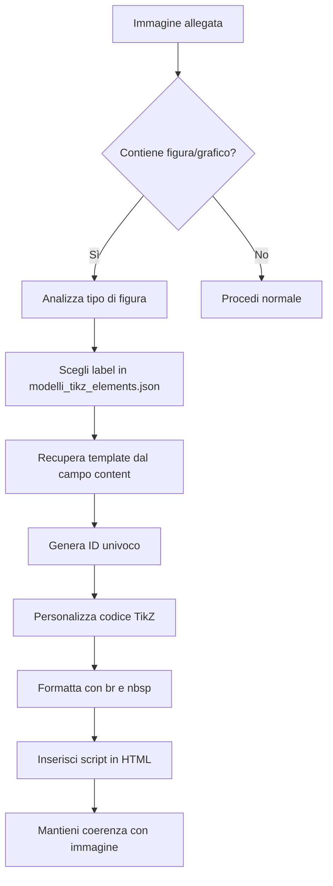

# Copilot Instructions - FisMatPant Project

## 🎯 Obiettivo Principale
Quando un esercizio da inserire include un'immagine con un grafico o una figura geometrica, l'agente deve automaticamente generare il codice TikZ appropriato basandosi sui modelli disponibili.

---

## 📋 Processo di Lavoro per Figure TikZ

### 1. **Riconoscimento Immagine**
Quando viene allegata un'immagine a un esercizio, analizza il contenuto per identificare:
- ✅ **Figure geometriche** (triangoli, poligoni, cerchi, angoli, ecc.)
- ✅ **Grafici di funzioni** (cartesiani, parabolici, lineari, ecc.)
- ✅ **Diagrammi fisici** (cinematica, dinamica, molle, ecc.)
- ✅ **Schemi e tabelle** (matrici, sistema di segni, studio del segno, ecc.)

### 2. **Selezione del Modello TikZ**
Consulta il file `modelli_tikz_elements.json` nella root del progetto e seleziona il **label più coerente** con la figura nell'immagine.

#### Esempi di Mapping:
| Tipo di Figura | Gruppo | Label Consigliato |
|---|---|---|
| Triangolo, Quadrilatero, Poligono | `gruppo-geometria` | `"poligono"` |
| Grafico di funzione (asse cartesiano) | `gruppo-grafici e funzioni` | `"grafico di funzione (axis)"` o `"grafico di funzione (TikzPure)"` |
| Problema di cinematica 1D | `gruppo-FISICA` | `"cinematica 1D"` |
| Studio del segno di disequazioni | `gruppo-matrici-e-tabelle` | `"studio del segno"` |
| Equazione di secondo grado | `gruppo-equ. di 2° grado` | `"auto-1step"` o `"personalizzata"` |
| Parte di piano cartesiano evidenziata | `gruppo-grafici e funzioni` | `"parte di piano"` |
| Molla con 3 stati | `gruppo-FISICA` | `"molla 3 stati"` |
| Vettori elettrostatici | `gruppo-FISICA` | `"n_Corpi n_Dist n_vect 1_Cond"` |

### 3. **Generazione ID Univoco**
Usa la funzione JavaScript già presente nel progetto per generare un ID univoco per lo script TikZ:

```javascript
"tikz_" + Date.now() + "_" + Math.random().toString(36).substr(2, 9)
```

**Esempio di ID generato:**
```
tikz_1769251281425_723j6dzt2
```

### 4. **Creazione del Codice TikZ**
1. **Recupera il contenuto** del modello dal campo `"content"` del label selezionato
2. **Personalizza il codice TikZ** basandoti sull'immagine allegata:
   - Modifica coordinate dei punti
   - Aggiusta label e testi
   - Adatta colori e stili
   - Aggiungi misure e annotazioni

3. **Formatta il codice HTML** usando:
   - `<br>` per **ogni nuovo comando/riga** di codice LaTeX
   - `&nbsp;` per **indentazione e spaziatura**
   - Mantieni la struttura gerarchica leggibile

### 5. **Struttura HTML dello Script TikZ**

```html
<script 
  id="[ID_UNIVOCO]" 
  type="text/tikz" 
  data-tex-packages='{"amsmath":""}' 
  data-tikz-libraries="arrows.meta,calc">
  
  [CODICE_TIKZ_FORMATTATO_CON_BR_E_NBSP]
  
</script>
```

#### Esempio Completo:
```html
<script id="tikz_1769251281425_723j6dzt2" type="text/tikz" data-tex-packages='{"amsmath":""}' data-tikz-libraries="arrows.meta,calc">
\usepackage{tikz}<br>
\usetikzlibrary{calc,angles,quotes}<br>
\begin{document}<br>
\begin{tikzpicture}[scale=1.2]<br>
&nbsp;&nbsp;% === PUNTI: nome/x/y/label/posLabel/visibilità ===<br>
&nbsp;&nbsp;\def\points{<br>
&nbsp;&nbsp;&nbsp;&nbsp;A/0/0/$A$/below left/1,<br>
&nbsp;&nbsp;&nbsp;&nbsp;B/5/0/$B$/below right/1,<br>
&nbsp;&nbsp;&nbsp;&nbsp;C/2.5/4/$C$/above/1<br>
&nbsp;&nbsp;}<br>
&nbsp;&nbsp;<br>
&nbsp;&nbsp;% Disegno triangolo principale<br>
&nbsp;&nbsp;\draw[thick, fill=yellow!30] (A) -- (B) -- (C) -- cycle;<br>
&nbsp;&nbsp;<br>
\end{tikzpicture}<br>
\end{document}
</script>
```

---

## 🎨 Convenzioni di Formattazione

### Indentazione con `&nbsp;`
- **Livello 0** (root): nessuno spazio
- **Livello 1** (primo livello): `&nbsp;&nbsp;` (2 spazi)
- **Livello 2** (secondo livello): `&nbsp;&nbsp;&nbsp;&nbsp;` (4 spazi)
- **Livello 3** (terzo livello): `&nbsp;&nbsp;&nbsp;&nbsp;&nbsp;&nbsp;` (6 spazi)

### Newline con `<br>`
Ogni comando LaTeX/TikZ deve terminare con `<br>` per andare a capo:
```
\usepackage{tikz}<br>
\begin{document}<br>
\begin{tikzpicture}<br>
```

### Commenti
Mantieni i commenti descrittivi per facilitare la modifica futura:
```html
&nbsp;&nbsp;% === PUNTI: nome/x/y/label/posLabel/visibilità ===<br>
```

---

## 📝 Attributi `<script>` Richiesti

| Attributo | Valore | Descrizione |
|---|---|---|
| `id` | `tikz_[timestamp]_[random]` | ID univoco generato |
| `type` | `"text/tikz"` | Tipo di script per TikZJax |
| `data-tex-packages` | `'{"amsmath":""}'` | Pacchetti LaTeX necessari |
| `data-tikz-libraries` | `"arrows.meta,calc,angles,quotes"` | Librerie TikZ usate |

### Nota sulle Librerie
Adatta `data-tikz-libraries` in base al modello scelto. Esempi:
- **Geometria**: `"calc,angles,quotes"`
- **Grafici**: `"arrows.meta,decorations"`
- **Fisica**: `"arrows.meta,decorations.pathmorphing"`

---

## ⚠️ Attenzione

1. **NON modificare** la funzione JavaScript per la generazione dell'ID (già presente nel progetto)
2. **Personalizza sempre** il codice TikZ dal template, non copiarlo identicamente
3. **Verifica** che il codice TikZ sia sintatticamente corretto prima di inserirlo
4. **Usa caratteri HTML entities** dove necessario:
   - `&agrave;` per à
   - `&nbsp;` per spazi non-breaking
   - `&lt;` per < (se necessario in testi)
   - `&gt;` per > (se necessario in testi)

---

## 🔍 Riferimenti

- **File modelli**: [`modelli_tikz_elements.json`](./modelli_tikz_elements.json)
- **Funzione ID univoco**: [`functions-mod.js:4436`](./functions-mod.js#L4436)
- **Processor TikZ**: [`functions-mod.js:4390-4420`](./functions-mod.js#L4390-L4420) (metodo `createTikzCode`)

---

## 🚀 Workflow Completo



---

**Versione:** 1.0.0  
**Data:** Febbraio 2026  
**Progetto:** FisMatPant - Sistema di gestione esercizi matematica/fisica
