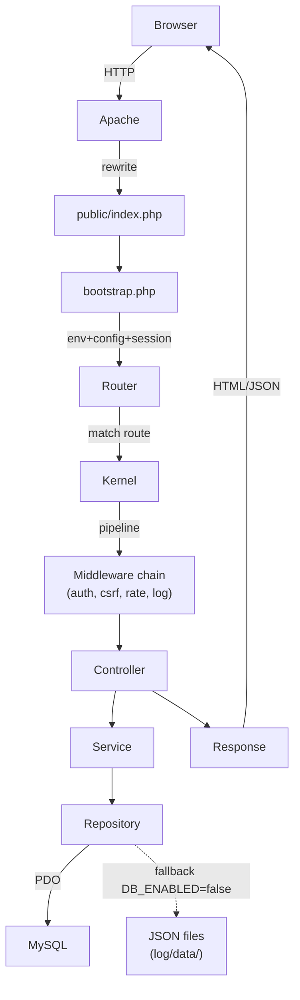

---
tags:
  - documentazione/architettura
date: 2026-04-23
tipo: architettura
status: finale
aliases: ["primer", "context", "overview"]
cssclasses: []
---

# LLM Primer — pantedu

> [!abstract] Leggi questo prima di qualsiasi altro file wiki.
> Per indice navigazionale completo: [[map]] (landing wiki).
> Per riferimenti normativi GDPR: [[decisions/ADR-007-gdpr-compliance]],
> [[decisions/ADR-006-envelope-encryption]].

## Stack in 10 righe

| Layer | Tecnologia | Versione | File chiave |
|-------|-----------|---------|------------|
| Runtime | PHP | ^8.3 | `app/bootstrap.php` |
| Web server | Apache/XAMPP + .htaccess | - | `public/index.php` |
| Database | MySQL 5.7+/MariaDB 10.2+ | utf8mb4 | `database/schema.sql` |
| ORM | Nessuno — PDO raw + Repository pattern | - | `app/Repositories/` |
| Frontend legacy | jQuery + vanilla JS modularizzato | - | `js/modules/` |
| Frontend moderno | Lit 3 Web Components (Shadow DOM) | - | `js/components/risdoc/` |
| Build | Vite 8 + esbuild | - | `vite.config.js` |
| Test unit | PHPUnit 11 | - | `tests/Unit/` |
| Test E2E | Playwright 1.59 | Chromium | `tests/e2e/` |
| PDF/TeX | pdflatex (MiKTeX/TexLive) | - | `storage/templates/risdoc/texCommon/` |

## Pattern architetturale

MVC custom PHP senza framework. Entry unico `public/index.php` → `Router` → middleware pipeline → `Controller` → `Service` → `Repository` → Response. Nessun DI container automatico: istanziazione manuale con parametri default (`new SomeService()`).

Dual-mode DB: `DB_ENABLED=false` → fallback JSON files legacy; `DB_ENABLED=true` → MySQL con optional dual-write (`DB_DUAL_WRITE`).

## Domini principali

| Dominio | File chiave | Funzione |
|---------|-------------|----------|
| core | `app/Core/` | Router, Kernel, Auth, Csrf, Session, Config, Database |
| auth | `app/Controllers/AuthController.php`, `app/Core/Auth.php` | Login, logout, role check, session |
| risdoc | `app/Controllers/Risdoc/`, `app/Services/Risdoc/` | Documenti docente, export TeX/PDF |
| esercizi | `app/Controllers/ExerciseController.php`, `js/modules/` | Gestione esercizi LaTeX |
| verifiche | `app/Controllers/VerificheController.php` | Verifiche scolastiche |
| mappe | `js/modules/integrations/google-apps.js` | Mappe concettuali (Google Drive) |
| admin | `app/Controllers/AdminController.php` et al. | Gestione utenti, analytics, infra |
| frontend | `js/modules/bootstrap.js`, `js/components/risdoc/` | UI, editor, print, Web Components |

## Flusso richiesta tipo

## Convenzioni critiche

| Convenzione      | Dettaglio                                                                   |
| ---------------- | --------------------------------------------------------------------------- |
| Namespace        | `App\` → `app/` (PSR-4)                                                     |
| Route middleware | Concatenati con `->middleware('csrf', 'auth', 'role:teacher')`              |
| Response         | Sempre `Response::json()` o `Response::html()` — mai `echo` raw             |
| Config           | `Config::get('section.key', $default)` — mai `$_ENV` diretto nei controller |
| Auth check       | `Auth::check()`, `Auth::hasRole('teacher')`, `Auth::hasAccess('admin')`     |
| ULID             | `App\Support\Ulid::generate()` per ID univoci                               |
| Safe path        | `App\Support\SafePath` per path traversal prevention                        |

## Zone critiche / non toccare

- **Pipeline TeX**: `app/Services/Risdoc/TexBuilder.php`, `ExportController::processLegacyTex()`, `storage/templates/risdoc/texCommon/` — accoppiata a pdflatex. Modificare con cautela.
- **Classi HTML protette**: `tex-group`, `element-tex`, `collex-item`, `problem`, `testo`, `collex`, `collexTab`, `dsa-checkbox-container` — referenziate da JS legacy e PHP. Non rinominare.
- **ID esame protetti**: `#infoVer`, `#header_page`, `#verTitle` — referenziati da script LaTeX generation.
- **risdoc.js legacy** (storico: `storage/templates/risdoc/risdoc.js`, 4931 righe) — Plan A, **rimosso dal repo** (in git history), superato dai Web Components Plan B.

## Per rispondere a domande su…

| Argomento | File wiki da caricare |
|-----------|----------------------|
| Routing / API | [[routing-and-api]] |
| DB / entità | [[database-schema]] |
| Auth / sicurezza | [[security-notes]] |
| Flussi utente | [[user-flows]] |
| Stack / pattern | [[architecture]] |
| Setup dev | [[dev-workflow]] |
| Termini dominio | [[glossary]] |
| Debito tecnico | [[technical-debt]] |
| Test / E2E | [[testing]] |
| Pipeline TeX/PDF (verifiche moderne) | [[tex-pipeline]] |
| Pipeline TeX/PDF (risdoc legacy) | [[domains/risdoc/tex-pipeline]] |
| Dominio risdoc | [[domains/risdoc/risdoc-overview]] |
| Dominio esercizi | [[domains/esercizi/esercizi-overview]] |
| RM tables (G23) | [[domains/esercizi/rm-table-rendering]] |
| Dominio auth | [[domains/auth/auth-overview]] |
| Dominio admin | [[domains/admin/admin-overview]] |
| Dominio frontend | [[domains/frontend/frontend-overview]] |
| Decisioni arch. | [[decisions/ADR-001-mvc-php-custom]] |
| Crypto envelope | [[decisions/ADR-006-envelope-encryption]] |
| GDPR compliance | [[decisions/ADR-007-gdpr-compliance]] |
| Audit reason | [[decisions/ADR-008-audit-reason]] |
| Drive integration (G1-G7) | [[decisions/ADR-009-drive-integration]] |
| Modern topbar + verifica_documents (G8) | [[decisions/ADR-010-modern-topbar]] |
| Verifiche multi-file (G20) | G20 (completato 2026-05-04, piano in git history) (live plan) |
| Server-side TeX compile via VPS (G21) | [[decisions/ADR-012-tex-compile-vps]] |
| Render TikZ server-side + GDPR (G22.S15) | [[decisions/ADR-013-tikz-server-render]] |
| Changelog (ultime modifiche) | [[changelog]] → mensili |

## Convenzioni wiki (importanti per evitare grafo Obsidian sporco)

1. **Wiki interna**: usa wikilink `[[file]]` (NO estensione `.md`).
2. **Riferimenti codice**: NON link markdown. Usa backtick monospace
   `` `app/path/file.php` ``. I link markdown verso file di codice
   (estensioni `.php`/`.js`/`.css` ecc) creano nodi finti nel grafo
   Obsidian che non sono wiki page.
3. **Riferimenti `docs/`**: link markdown standard `[label](../docs/...)`.
4. **Changelog**: ogni nuova entry va in `wiki/changelog/YYYY-MM.md`
   (mensile), MAI in `wiki/changelog.md` (è solo dispatcher).
5. **CI guard**: `php tools/wiki/strip_code_links.php --check` blocca
   commit con link diretti al codice nelle pagine wiki.

Vedi anche: [[map]] (landing wiki) per indice completo.
