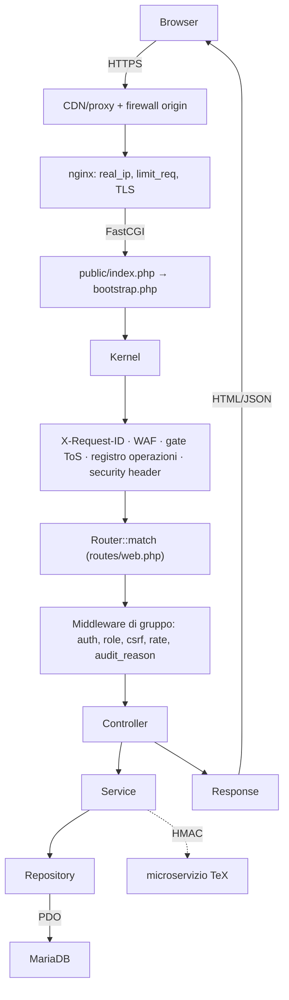

---
tags:
  - documentazione/architettura
date: 2026-09-23
tipo: architettura
status: finale
aliases: ["primer", "context", "overview"]
cssclasses: []
---

# LLM Primer — pantedu

> [!abstract] Leggi questo prima di qualsiasi altro file wiki.
> Per indice navigazionale completo: [[map]]. Ultimo aggiornamento: revisione
> architetturale 2026-09 (`docs/analysis/revisione-architetturale-2026-09.md`).

## Stack in 10 righe

| Layer | Tecnologia | File chiave |
|-------|-----------|-------------|
| Runtime | PHP `^8.3` (8.4 in produzione), PSR-4 `App\` → `app/` | `composer.json`, `app/bootstrap.php` |
| Web server | nginx + PHP-FPM in produzione (`infra/nginx/`); in sviluppo il server integrato di PHP in WSL (`tools/dev/wsl/server.sh`, vedi `docs/dev/sviluppo-in-wsl.md`) | `public/index.php` |
| Database | MariaDB (10.11 in sviluppo/E2E, 11.8 in produzione e nel lavoro d'integrazione), utf8mb4; migrazioni con sintassi MariaDB, non intercambiabili con MySQL (`ADD COLUMN IF NOT EXISTS`); PDO raw + repository, nessun ORM; tre utenti DB (app, migrazioni, manutenzione) | `app/Core/Database.php`, `database/migrations/` (`ls database/migrations \| wc -l` per contarle) |
| Frontend | moduli ES vanilla in `js/modules/` (zero jQuery) + Web Component Lit 3 in `js/components/` | `js/modules/bootstrap.js`, `js/components/risdoc/index.js` |
| Build | Vite 8, entry multiple, manifest letto da `ViteManifest::script()` | `vite.config.js`, `public/build/` |
| Test | PHPUnit 11, Vitest 4, Playwright 1.59 (senza `@tex`, `@pdflatex`, `@istanza` in CI) — numero di test: [[testing]] | `tests/Unit`, `tests/Integration`, `tests/js-unit`, `tests/e2e` |
| TeX/PDF | microservizio Python separato (`tools/tex-compile-vps/`) chiamato via HMAC: compile, format, TikZ→SVG | `app/Services/TexCompile/*` |
| Sicurezza | WAF applicativo globale, cifratura a busta per docente, registri di audit append-only con trigger e catena di impronte, 2FA per ruolo | `app/Middleware/WafMiddleware.php`, `app/Services/Crypto/`, `app/Services/Audit/` |
| Deploy | push su `main` → webhook GitHub → `tools/webhook/deploy-container.sh` sul VPS: immagine dal registro (o costruita lì), istantanea del database, migrazioni, container nuovo sulla porta libera, scambio di nginx dopo la verifica. Dall'8 settembre 2026; prima era `deploy.sh`, sulla cartella servita. Mappa completa: `docs/dev/ci-cd.md` | `tools/webhook/`, `tools/systemd/`, `docker/` |
| Configurazione | `.env` (versionato, valori pubblici) + `.env.local` (segreti) → `app/Config/*.php` → `Config::get()`; override runtime in `storage/config/*.json`; toggle WAF nella tabella `waf_config` | `app/Config/` |

## Pattern architetturale

MVC custom PHP senza framework. Entry unico `public/index.php` → `Router`
(rotte in `routes/web.php`, elenco generato in `docs/ROUTES.md`) → `Kernel` → middleware di gruppo
(alias e funzione di ognuno in [[core-overview]], «Middleware») → `Controller` →
`Service` → `Repository` → `Response`. A ogni richiesta il Kernel applica da
solo, prima del match: X-Request-ID, WAF, gate ToS/AUP, registro delle
operazioni, security header. Nessun DI container: istanziazione manuale.

La regola dei confini fra strati — dove sta il SQL, chi legge `php://input`,
dove si legge l'ambiente — e il cricchetto che la sorveglia sono in
[[decisions/ADR-049-confini-degli-strati]] (debito 17, 18, 180, 181).
[[decisions/ADR-032-deployment-scenarios]]: lo **scenario** (`personal`,
`colleagues`, `institute`) decide iscrizioni, account studente e documenti
legali attivi; è la sorgente di verità che allinea i flag legacy.

## Domini principali

| Dominio | File chiave | Funzione |
|---------|-------------|----------|
| core | `app/Core/`, `app/Middleware/` | Router, Kernel, Auth, Csrf, Session, Config, Database, Migrator |
| auth | `app/Controllers/AuthController.php`, `TotpController.php`, `PasswordResetController.php`, `app/Support/TwoFactorEnforcement.php`, `ClassAccessGrant.php` | login in due passaggi, 2FA app/email, recupero password, credenziale di classe, registrazione |
| risdoc | `app/Controllers/Risdoc/`, `app/Services/Risdoc/` (+ `Pt/`), `js/components/risdoc/`, `schemas/risdoc/` | modelli documentali del docente: editor PT, compilazioni cifrate, override, export TeX |
| esercizi e contenuti | `app/Controllers/ContentStudyController.php`, `TeacherContentController.php`, `QuesitoController.php`, `GroupController.php`, `app/Services/Contract/`, `js/modules/editor/` | contract JSON, editor inline, studio, pubblicazione |
| verifiche | `app/Controllers/Verifica*Controller.php`, `app/Services/Verifica/`, `app/Services/TexBuilder*` | documenti verifica cifrati, build TeX multi-file, compile sul microservizio |
| mappe | `app/Controllers/MapsController.php`, `app/Services/Maps/`, `app/Services/Drive/` | mappe drawio cifrate, signed URL, sync Drive |
| curriculum e sezioni | `app/Services/CurriculumService.php`, `MiurAdozioniImporter.php`, `TeacherSectionService.php`, `app/Support/CurriculumLookup.php` | indirizzi/classi/materie dal dataset MIUR, incarichi dei docenti, classe degli studenti |
| admin | `app/Controllers/Admin/`, `AdminController.php`, `UsersAdminController.php` | strumenti, utenti, istituti, sezioni, GDPR, WAF, backup, log, scenari |
| gdpr e legale | `app/Services/Gdpr/`, `docs/legal/versions.json`, `tools/ci/check-legal-versions.mjs` | consensi, cancellazioni, takedown, ToS/AUP versionati, export art. 15 |
| pdf-import | `app/Controllers/Teacher/PdfImportController.php`, `app/Services/PdfImport/` | estrazione esercizi da PDF via LLM (opt-in, marcatura AI Act) |
| frontend | `js/modules/bootstrap.js`, `js/entries/`, `js/components/` | UI, sidebar data-driven, editor, modali lazy |

## Flusso richiesta tipo

```mermaid
flowchart TD
    Browser -->|HTTPS| Edge["CDN/proxy + firewall origin"]
    Edge --> Nginx["nginx: real_ip, limit_req, TLS"]
    Nginx -->|FastCGI| Index["public/index.php → bootstrap.php"]
    Index --> Kernel
    Kernel --> Global["X-Request-ID · WAF · gate ToS · registro operazioni · security header"]
    Global --> Router["Router::match (routes/web.php)"]
    Router --> MW["Middleware di gruppo: auth, role, csrf, rate, audit_reason"]
    MW --> Controller --> Service --> Repository -->|PDO| MariaDB
    Service -.->|HMAC| Tex["microservizio TeX"]
    Controller --> Response -->|HTML/JSON| Browser
```

## Convenzioni critiche

| Convenzione | Dettaglio |
|---|---|
| Namespace | `App\` → `app/` (PSR-4) |
| Route middleware | `->middleware('csrf', 'rate:bucket,N')`; gruppi con `['middleware' => [...]]` |
| Response | `Response::ok($data)` / `Response::fail($error, $status)` per il JSON (`{ok, ...}`, ADR-034), `Response::html()` per le pagine — mai `echo`; ~500 risposte `{error}` senza `ok` sono in migrazione |
| Request | corpo JSON con `$req->json()` (API), `$req->jsonObbligatorio()` (rigoroso: 400/413) o `$req->body()` (JSON o form) — mai `php://input` nei controller; troppo grande = 413 sempre; id docente con `TeacherContextResolver::currentTeacherId()` |
| Config | `Config::get('section.key', $default)` — mai `$_ENV` fuori da `app/Config` (`npm run env:check` verifica `.env.example`) |
| Dati | il SQL sta in `app/Repositories/<Dominio>/` o in un servizio con `PDO` iniettato; vietato nei controller/viste/`app/Core` salvo `Auth`, `Database`, `Migrator`; regola per esteso e cricchetto che la sorveglia in [[decisions/ADR-049-confini-degli-strati]] |
| Auth | `Auth::check()`, `Auth::hasRole()`, `Auth::hasAccess('admin')`, `Auth::isSuperAdmin()`; super-admin è un flag, non un ruolo |
| Mutazioni admin | motivazione obbligatoria (`X-Audit-Reason`, 10-255 caratteri), `AUDIT_REASON_MODE=enforce` |
| Registri | IP solo come impronta con chiave (`App\Support\ImprontaIp`, regola in [[security-notes]]), User-Agent come hash (`RequestFingerprint`); tabelle di audit append-only |
| Path | `App\Support\SafePath` contro il path traversal; ID con `App\Support\Ulid` |
| Commit | Conventional Commits in italiano; ogni push su `main` va in produzione |

## Zone critiche / non toccare

- **Registri di audit**: `audit_activity_log`, `content_action_log`, `privileged_access_log`, `teacher_recovery_audit` sono append-only via trigger creati dall'utente delle migrazioni; la catena di impronte (`AuditChain`, timer `pantedu-audit-chain`) li sigilla ogni giorno.
- **Cifratura**: `KMS_MASTER_KEY` solo in `.env.local`; `TeacherCryptoService`, `CompilationRepository` cifrano body, blob e compilazioni. Cambiare i prefissi HKDF invalida tutto.
- **Pipeline TeX**: `app/Services/TexBuilder.php` (verifiche),
  `app/Services/Risdoc/Pt/PtToTex.php` e `Risdoc/TexBuilder.php` (risdoc),
  `storage/templates/**`: accoppiati a pdflatex; i nove test un tempo
  sospesi (`TEST_ROT`) sono stati decisi il 2026-09-04 ([[testing]]).
- **Classi HTML protette**: `tex-group`, `element-tex`, `collex-item`,
  `problem`, `testo`, `collex`, `collexTab`, `dsa-checkbox-container`;
  ID `#infoVer`, `#header_page`, `#verTitle`.
- **Documenti legali**: `docs/legal/versions.json` è la fonte di verità;
  i consensi registrano il `versione:` dell'informativa dello scenario
  attivo, letto dal file (`DeploymentScenario::versioneInformativa()`).

## Per rispondere a domande su…

| Argomento | File wiki da caricare |
|-----------|----------------------|
| Routing / API | [[routing-and-api]], poi `docs/ROUTES.md` |
| DB / entità | [[database-schema]] |
| Auth, 2FA, credenziale di classe | [[domains/auth/auth-overview]], [[security-notes]] |
| Scenari di esercizio | [[decisions/ADR-032-deployment-scenarios]] |
| WAF | [[waf]] |
| Audit append-only, catena di impronte | [[security-notes]] |
| Flussi utente | [[user-flows]] |
| Stack / pattern | [[architecture]] |
| Setup dev, quality gate | [[dev-workflow]] |
| Termini dominio | [[glossary]] |
| Debito tecnico | [[technical-debt]] |
| Test / E2E / TEST_ROT | [[testing]] |
| Pipeline TeX verifiche | [[tex-pipeline]] |
| Pipeline TeX risdoc | [[domains/risdoc/tex-pipeline]] |
| Risdoc, editor PT, valori per terna, formule | [[domains/risdoc/risdoc-overview]], [[decisions/ADR-030-document-terna-scoped-values]], [[decisions/ADR-031-table-formulas]] |
| Esercizi, editor | [[domains/esercizi/esercizi-overview]], [[domains/esercizi/editor-architecture]] |
| Verifiche | [[domains/verifiche/verifiche-overview]] |
| Mappe, Drive | [[domains/mappe/mappe-overview]], [[decisions/ADR-009-drive-integration]] |
| Admin | [[domains/admin/admin-overview]] |
| Frontend, sidebar | [[domains/frontend/frontend-overview]], [[decisions/ADR-027-dynamic-sidebar-config]] |
| Crypto envelope | [[decisions/ADR-006-envelope-encryption]] |
| GDPR | [[decisions/ADR-007-gdpr-compliance]] |
| Decisioni (elenco in `wiki/decisions/`) | [[map]] § Decisioni architetturali |
| Cosa è cambiato | [[changelog]] → mensili |

## Convenzioni wiki

1. Wiki interna: wikilink Obsidian (doppie parentesi quadre, percorso dalla radice della wiki, senza estensione).
2. Riferimenti al codice in backtick (`app/path/file.php`), mai come link:
   i link ai file di codice creano nodi finti nel grafo Obsidian.
3. Riferimenti a `docs/`: link markdown `[label](../docs/...)`.
4. Changelog: ogni voce in `wiki/changelog/YYYY-MM.md`, o nel file della settimana (`YYYY-MM-settN.md`) quando il mese è diviso; `changelog.md` è solo il dispatcher.
5. Guard CI: `php tools/wiki/strip_code_links.php --check`.
6. Aggiornamento: skill `aggiorna-wiki`, che parte dall'ultimo report in `docs/analysis/`.
