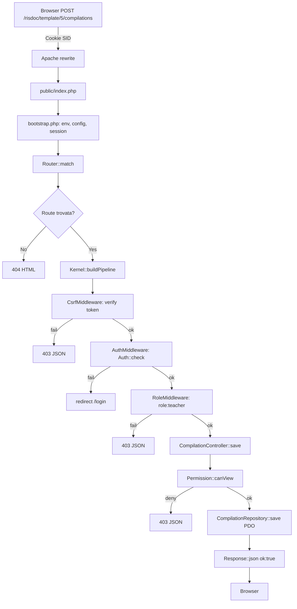

---
tags:
  - documentazione/architettura
date: 2026-04-23
tipo: architettura
status: finale
aliases: ["architecture", "architettura"]
cssclasses: []
---

# Architecture

## Stack verificato

| Layer | Tecnologia | File di riferimento |
|-------|-----------|-------------------|
| PHP runtime | PHP ^8.3, PSR-4 autoload | `composer.json` |
| HTTP | Apache + mod_rewrite, routing via `.htaccess` → `public/index.php` | `public/.htaccess` |
| ORM / DB | PDO raw, MySQL 5.7+/MariaDB utf8mb4, transizioni JSON→DB | `app/Core/Database.php` |
| Session | PHP session nativa (`DbSessionHandler` opzionale), gestita da `Session` | `app/Core/Session.php` |
| Config | Dotenv → `$_ENV` → `Config::get()` | `app/Core/Config.php`, `app/Config/` |
| View | PHP template puro, `View::render()` | `app/Core/View.php`, `views/` |
| Frontend legacy | jQuery + moduli JS vanilla (non bundle) | `js/modules/`, `js/vendor/` |
| Frontend moderno | Lit 3 Web Components, Shadow DOM, Vite 8 bundle | `js/components/risdoc/`, `public/build/` |
| Storage | `LocalStorageProvider` (file system) o `S3CompatibleStorageProvider` | `app/Support/Storage/` |
| PDF | pdflatex (MiKTeX/TexLive server-side), ZIP export | `storage/templates/risdoc/texCommon/` |
| Test unit | PHPUnit 11 | `tests/Unit/`, `phpunit.xml` |
| Test E2E | Playwright 1.59, Chromium, target `http://pantedu.local` | `tests/e2e/`, `playwright.config.js` |

## Pattern architetturale

**MVC custom PHP** con middleware pipeline ispirata a Laravel senza dipendere dal framework.

```
Request → Router → Kernel::buildPipeline() → Middleware[] → Controller → Service → Repository → Response
```

- **Router** (`app/Core/Router.php`): registra route con pattern `{param}`, `{param?}`, `{param*}`. Match su path + method. Restituisce `Route` con `params[]`.
- **Kernel** (`app/Core/Kernel.php`): costruisce pipeline middleware in ordine inverso (stacking). Mappa alias → classi middleware. Catch globale `Throwable` → pagina errore.
- **Middleware** (`app/Middleware/`): interfaccia `handle(Request, callable $next, ...$args): Response`. Alias: `auth`, `csrf`, `role`, `rate`, `log`, `legacy_gone`, `sadmin_audit`.
- **Controller**: nessuna classe base. Istanziato direttamente da Kernel. Riceve `(Request $req, array $params)`.
- **Service**: logica di business. Nessuna interfaccia obbligatoria (tranne `Contract/`).
- **Repository**: accesso dati. Interfaccia `UserRepositoryInterface`. Dual-write DB+JSON durante transizione.

## Livelli e boundary

```
┌─────────────────────────────────────────────────────┐
│ HTTP Layer (Apache + public/index.php)               │
├─────────────────────────────────────────────────────┤
│ Kernel + Router + Middleware Pipeline                 │
├─────────────────────────────────────────────────────┤
│ Controllers (app/Controllers/)                        │
│   - Input validation   - Auth/Permission check        │
│   - Delegate to Service - Return Response             │
├─────────────────────────────────────────────────────┤
│ Services (app/Services/)                              │
│   - Business logic     - Orchestration                │
├─────────────────────────────────────────────────────┤
│ Repositories (app/Repositories/)                      │
│   - Data access        - DB + JSON fallback           │
├─────────────────────────────────────────────────────┤
│ Domain (app/Domain/) — entità pure (User, Role, …)   │
├─────────────────────────────────────────────────────┤
│ Infra: MySQL | JSON files | pdflatex | Storage S3/Local│
└─────────────────────────────────────────────────────┘
```

## Flowchart end-to-end richiesta autenticata



## Bottleneck e note critiche

| Area | Issue | Mitigazione attuale |
|------|-------|-------------------|
| `ExportController::processLegacyTex()` | ~350 LOC metodo privato, 8 step regex su .tex | Accettato: logica unica, non duplicata |
| ~~`risdoc.js` legacy (4931 LOC)~~ | IIFE monolitica Piano A, non bundle | Rimossa dal repo (in git history); superseded da Web Components Plan B |
| Dual-write DB+JSON | Rischio desync se una scrittura fallisce | `DB_DUAL_WRITE=false` dopo consolidamento |
| Vite manifest PHP | `ViteManifest::script()` integrato | ✅ Collegato in `views/partials/head.php` (bundle quando manifest presente, fallback moduli diretti in dev) |
| pdflatex server-side | Non disponibile su Aruba shared hosting base | Workaround: ZIP export + Overleaf snip_uri |
| Google Apps Script | Non testato in CI, dipende da token utente | Separato da core app, best-effort |
