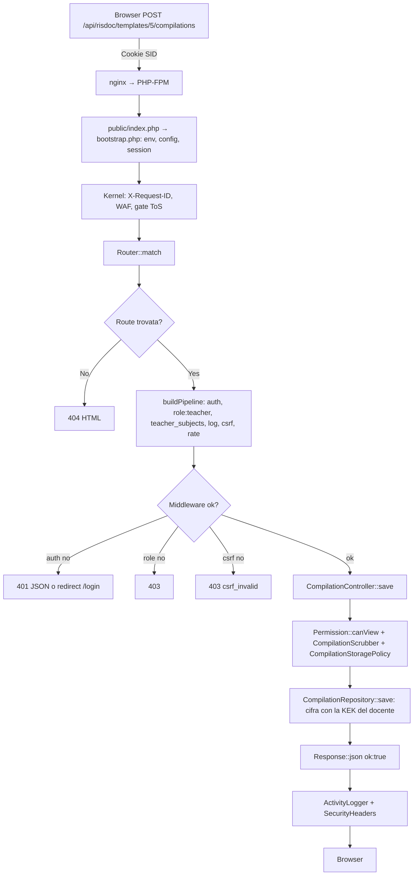

---
tags:
  - documentazione/architettura
date: 2026-09-23
tipo: architettura
status: finale
aliases: ["architecture", "architettura"]
cssclasses: []
---

# Architecture

## Stack verificato

| Layer | Tecnologia | File di riferimento |
|-------|-----------|-------------------|
| PHP runtime | PHP `^8.3` (8.4 in produzione), PSR-4 `App\` → `app/`, nessun framework | `composer.json`, `app/bootstrap.php` |
| HTTP | nginx + PHP-FPM (`infra/nginx/pantedu.eu.conf`, `ratelimit-zones.conf`); in sviluppo il server integrato di PHP in WSL, col router della CI che rifà gli alias di nginx (`tools/dev/wsl/server.sh`) | `public/index.php` |
| Bordo | CDN/proxy con origin lockato al firewall, `real_ip` in nginx; WAF applicativo nel Kernel | `app/Middleware/WafMiddleware.php`, `app/Services/Waf/EdgeContext.php` |
| DB | MariaDB, PDO raw, viste sulle tabelle `*_data`, trigger append-only; tre utenti; numero di migrazioni: `ls database/migrations \| wc -l` | `app/Core/Database.php`, [[database-schema]] |
| Sessione | PHP nativa. Dove si salvano lo dice `SESSION_DRIVER` (ADR-039): `file` in `storage/sessions` dei dati d'istanza, uguale in sviluppo, CI e produzione, oppure `database` (`DbSessionHandler`, con un blocco per sessione; non pronto per la produzione, voce 104). Impostazioni in `Session::impostazioni`, modalità stretta ovunque; l'id cambia solo a login, secondo fattore e cambio di ruolo; login in due passaggi | `app/Core/Session.php`, `app/Core/Auth.php` |
| Config | `.env` + `.env.local` → `app/Config/*.php` → `Config::get()`; override runtime in `storage/config/*.json`; toggle WAF in `waf_config` | `app/Core/Config.php`, [[environment-variables]] |
| View | template PHP puri con `View::render()`; script inline residuo in cinque partial ([[technical-debt]] voce 19, chiusa per il resto); le pagine più pesanti sono entry Vite | `app/Core/View.php`, `views/` |
| Frontend | moduli ES vanilla (`js/modules/`, zero jQuery) + 21 Web Component Lit 3 (`js/components/`); Vite 8, entry multiple (`vite.config.js`); Lit, pdf.js, pako e MathJax sono nel bundle da `package.json`, non più da CDN — restano da CDN solo GeoGebra (dichiarato, [[technical-debt]] voce 16) e il viewer diagrams.net delle mappe | `vite.config.js`, `app/Support/ViteManifest.php` |
| Storage | `LocalStorageProvider` (default) o `S3CompatibleStorageProvider`; blob cifrati a busta | `app/Support/Storage/` |
| TeX/PDF | microservizio Python separato (`tools/tex-compile-vps/`): `/compile`, `/compile-bundle`, `/format-tex`, `/render-tikz`, via HMAC | `app/Services/TexCompile/` |
| Posta | Resend (API) tramite `Mailer`; coda `jobs` + `bin/worker.php` | `app/Services/Mailer.php` |
| Test | PHPUnit 11 (unit + integration su `pantedu_test`), Vitest 4, Playwright 1.59 | [[testing]] |

## Pattern architetturale

MVC custom con pipeline di middleware.

```
Request → Kernel::handle()
   ├─ RequestIdMiddleware::ensure()            (X-Request-ID)
   ├─ CurriculumLookup::preload(), LogRotator  (per richiesta)
   ├─ WafMiddleware  ─┐
   │  TosAcceptance   ├─ applicati a ogni richiesta, prima del match
   └─ Router::match → buildPipeline(middleware del gruppo) → Controller → Service → Repository → Response
   ├─ ActivityLogger  (registro delle operazioni: scritture e tentativi negati)
   └─ SecurityHeadersMiddleware (CSP, HSTS, …)
```

- **Router** (`app/Core/Router.php`, `Route.php`): pattern `{param}`,
  `{param?}`, `{param*}`; scansione lineare delle rotte (elenco generato:
  `docs/ROUTES.md`), regex compilate alla prima verifica.
- **Kernel** (`app/Core/Kernel.php`): mappa alias → classi middleware (l'elenco,
  con la funzione di ognuno, sta in [[core-overview]], «Middleware»); catch
  globale `Throwable` → pagina di errore.
- **Controller** (nessuna classe base, `(Request, array $params)`, contati con
  `find app/Controllers -name '*.php' | wc -l`); i parametri della rotta
  (`{id}`, `{key}`, …) arrivano solo come secondo argomento, `Request` non ha
  `params`: `tests/Unit/Core/ParametriDiRottaTest.php` fallisce se un'azione
  con un segnaposto non lo dichiara (23/9/2026); helper come `teacherId()` e
  la lettura del body JSON sono duplicati ([[technical-debt]] voce 21).
- **Service** (`find app/Services -name '*.php' | wc -l`, in sottodomini per
  dominio); **Repository**, tutti sotto `app/Repositories/<Dominio>/`
  (metodi nominati per intento, [[decisions/ADR-049-confini-degli-strati]]);
  **Domain** (`User`, `Role`, `ViewerContext`, `ContentVisibilityPolicy`).
- **Support**: `DeploymentScenario` (ADR-032), `ClassAccessGrant`,
  `TwoFactorEnforcement`, `TosEnforcement`, `CurriculumLookup`,
  `SafePath`, `Validator`, `ViteManifest`, `Storage/*`.

## Livelli e boundary

```
┌──────────────────────────────────────────────────────────────┐
│ Bordo: CDN/proxy → firewall origin → nginx (real_ip, limit_req) │
├──────────────────────────────────────────────────────────────┤
│ Kernel: X-Request-ID · WAF · gate ToS/AUP · registro operazioni │
│         · security header                                      │
├──────────────────────────────────────────────────────────────┤
│ Middleware di gruppo (alias ed elenco: core-overview)          │
├──────────────────────────────────────────────────────────────┤
│ Controller → Service → Repository (app/Repositories/<Dominio>/)│
│   Domain: User, Role, ViewerContext, ContentVisibilityPolicy   │
├──────────────────────────────────────────────────────────────┤
│ Dati: MariaDB (viste *_data, trigger append-only, 3 utenti)    │
│   Blob cifrati (storage/objects, maps_enc, verifiche_enc)      │
├──────────────────────────────────────────────────────────────┤
│ Esterni: microservizio TeX (HMAC) · Resend · Google Drive ·    │
│   GitHub · provider LLM (opt-in) · CDN per GeoGebra e per il   │
│   viewer diagrams.net delle mappe                              │
└──────────────────────────────────────────────────────────────┘
```

Il boundary dichiarato che resta da CDN è GeoGebra ([[technical-debt]] voce
16, chiusa come eccezione) e il viewer diagrams.net delle mappe (D-18 della
revisione architetturale, decisione del manutentore). Il boundary più poroso
resta quello dei dati: i controller e i servizi che eseguono SQL direttamente
invece di passare da un repository sono un elenco fisso sorvegliato da
[[decisions/ADR-049-confini-degli-strati]] ([[technical-debt]] voce 17); il
conteggio di oggi è in `tools/ci/confini-degli-strati.json`.

## Flowchart end-to-end richiesta autenticata


```mermaid
flowchart TD
    A[Browser POST /api/risdoc/templates/5/compilations] -->|Cookie SID| B[nginx → PHP-FPM]
    B --> C[public/index.php → bootstrap.php: env, config, session]
    C --> D[Kernel: X-Request-ID, WAF, gate ToS]
    D --> E[Router::match]
    E --> F{Route trovata?}
    F -- No --> G[404 HTML]
    F -- Yes --> H[buildPipeline: auth, role:teacher, teacher_subjects, log, csrf, rate]
    H --> I{Middleware ok?}
    I -- auth no --> J[401 JSON o redirect /login]
    I -- role no --> K[403]
    I -- csrf no --> L[403 csrf_invalid]
    I -- ok --> M[CompilationController::save]
    M --> N[Permission::canView + CompilationScrubber + CompilationStoragePolicy]
    N --> O[CompilationRepository::save: cifra con la KEK del docente]
    O --> P[Response::json ok:true]
    P --> Q[ActivityLogger + SecurityHeaders]
    Q --> R[Browser]
```

## Bottleneck e note critiche

Lo stato di ogni punto critico cambia più spesso di questa pagina: si legge
nel registro del debito ([[technical-debt]]), non qui. In sintesi, con la voce
che tiene i dettagli verificati sul codice:

- `ContentStudyController` che compone HTML nel controller — voce 18 (God
  object in ricrescita, aperta);
- SQL fuori dai repository — voce 17 (aperta, sorvegliata da
  [[decisions/ADR-049-confini-degli-strati]]);
- script inline nelle viste — voce 19 (chiusa: resta in cinque partial);
- librerie frontend da CDN — voce 16 (chiusa: GeoGebra resta un'eccezione
  dichiarata);
- doppia scrittura DB + JSON — voce 4 (chiusa in scrittura, aperta in
  lettura: `PrintInfoService` fa ancora prevalere un JSON rimasto indietro);
- costo fisso per richiesta (scansione lineare delle rotte, preload
  curriculum, rotazione log, sessione prima del WAF) — voce 27 (aperta,
  priorità bassa).

`ExportController::processLegacyTex()`, che questa sezione citava come
codice morto da togliere (voce 1), è stato tolto il 2026-09-23 insieme ai
suoi helper privati: la voce è chiusa.
