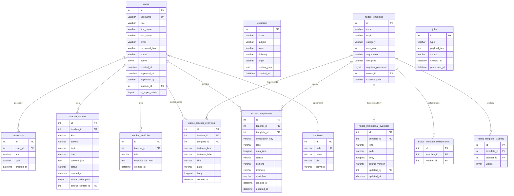

---
tags:
  - documentazione/database
date: 2026-04-23
tipo: database
status: finale
aliases: ["database", "schema", "db"]
cssclasses: []
---

# Database Schema

## Stack DB

MySQL 5.7+/MariaDB 10.2+, charset `utf8mb4_unicode_ci`. Schema in `database/schema.sql`. Migrations in `database/migrations/001–008`.

**Dual-mode**: `DB_ENABLED=false` → fallback JSON files in `log/data/` e `storage/`. `DB_DUAL_WRITE=true` → write su DB e JSON simultaneamente (transizione).

## ERD

## Dizionario dati — tabelle principali

### `users`
| Colonna | Tipo | Note |
|---------|------|------|
| `role` | VARCHAR(32) | `student \| teacher \| collaborator \| administrator` |
| `status` | VARCHAR(32) | `pending \| active \| rejected` |
| `active` | TINYINT(1) | 0=disabilitato, 1=attivo |
| `is_super_admin` | TINYINT(1) | Aggiunto da migration 002; flag tecnico ortogonale al role |
| `institute_id` | INT FK | Aggiunto da migration 001 |

### `risdoc_templates`
| Colonna | Tipo | Note |
|---------|------|------|
| `origin` | VARCHAR | `IIS \| altro` — istituto sorgente |
| `category` | VARCHAR | categoria docente (es. `piani-annuali`) |
| `num_arg` | INT | ordinamento all'interno della categoria |
| `schema_path` | VARCHAR | aggiunto migration 008; path relativo a `schemas/risdoc/*.json` |
| `requires_password` | TINYINT | template protetto da password docente |

### `risdoc_compilations`
| Colonna | Tipo | Note |
|---------|------|------|
| `compilation_key` | VARCHAR | chiave univoca per upsert (es. `{classe}_{anno}_{uuid}`) |
| `data_json` | LONGTEXT | form_state serializzato; max 2MB validato in controller |
| `classe`, `sezione`, `indirizzo`, `disciplina` | VARCHAR NULL | filtri contestuali; NULL = no filter |

### `teacher_content`
| Colonna | Tipo | Note |
|---------|------|------|
| `kind` | VARCHAR | `eser \| verifica \| lab \| mappa` |
| `content_json` | TEXT | Contract v1 JSON (`schemas/pantedu.content.v1.json`) |
| `shared_with_pool` | TINYINT | migration 003; condivide con pool generale |
| `source_content_id` | INT FK NULL | migration 004; provenance clone |

### `risdoc_teacher_overrides`
| Colonna | Tipo | Note |
|---------|------|------|
| `instance_key` | VARCHAR(64) | Phase 24.58: slug istanza (`''` = base, multi-instance fork) |
| `instance_label` | VARCHAR(255) | Phase 24.58: label UI istanza (es. "Piano annuale 3A") |
| `kind` | ENUM | `html \| tex \| css \| json \| image \| texCommon` |
| `path` | VARCHAR | path relativo alla source dir del template |
| `body` | LONGTEXT | contenuto override; NULL se deleted |
| `image_hash` | VARCHAR(64) | sha256 file upload (kind=image) |
| `source_version` | VARCHAR(64) | hash sorgente al fork (drift detection) |
| **UNIQUE** | | `(teacher_id, template_id, instance_key, kind, path)` |

### `risdoc_institutional_overrides` (Phase 24.55)
| Colonna | Tipo | Note |
|---------|------|------|
| `template_id` | INT FK | template istituzionale |
| `kind` | ENUM | `html \| tex \| css \| json \| image \| texCommon \| schema` |
| `path` | VARCHAR | path relativo |
| `body` | LONGTEXT | baseline admin-edited (sopra al disk, sotto teacher overrides) |
| `updated_by` | INT FK NULL | super-admin che ha salvato |
| **UNIQUE** | | `(template_id, kind, path)` |

## Migrations

| # | File | Cosa aggiunge |
|---|------|--------------|
| 001 | `001_add_users_institute_id.sql` | FK `institute_id` in `users` |
| 002 | `002_add_users_is_super_admin.sql` | Colonna `is_super_admin` |
| 003 | `003_add_teacher_content_shared_with_pool.sql` | `shared_with_pool` |
| 004 | `004_add_teacher_content_source_content_id.sql` | `source_content_id` |
| 005 | `005_drop_dead_template_cache.sql` | Rimuove tabella cache obsoleta |
| 006 | `006_risdoc_teacher_overrides.sql` | Tabella `risdoc_teacher_overrides` |
| 007 | `007_risdoc_compilations.sql` | Tabella `risdoc_compilations` |
| 008 | `008_risdoc_templates_schema_path.sql` | Colonna `schema_path` in `risdoc_templates` |
| 009 | `009_risdoc_templates_body_pt.sql` | Phase 24.50: colonna `body_pt` LONGTEXT (PT seed admin) |
| 010 | `010_risdoc_institutional_overrides.sql` | Phase 24.55: tabella admin baseline overrides |
| 011 | `011_risdoc_overrides_multi_instance.sql` | Phase 24.58: `instance_key`+`instance_label` su `risdoc_teacher_overrides`, ALTER UNIQUE |

## Repository layer

| Repository | File | Tabelle |
|-----------|------|---------|
| `UserRepository` | `app/Repositories/UserRepository.php` | `users` |
| `ExerciseRepository` | `app/Repositories/ExerciseRepository.php` | `exercises` |
| `TeacherContentRepository` | `app/Repositories/TeacherContentRepository.php` | `teacher_content` |
| `InstituteRepository` | `app/Repositories/InstituteRepository.php` | `institutes` |
| `StorageObjectRepository` | `app/Repositories/StorageObjectRepository.php` | `storage_objects` |
| `TeacherCredentialRepository` | `app/Repositories/TeacherCredentialRepository.php` | `teacher_access_credentials` |
| `CompilationRepository` | `app/Services/Risdoc/CompilationRepository.php` | `risdoc_compilations` |
| `OverrideRepository` | `app/Services/Risdoc/OverrideRepository.php` | `risdoc_teacher_overrides` |
| `JobRepository` | `app/Jobs/JobRepository.php` | `jobs` |
