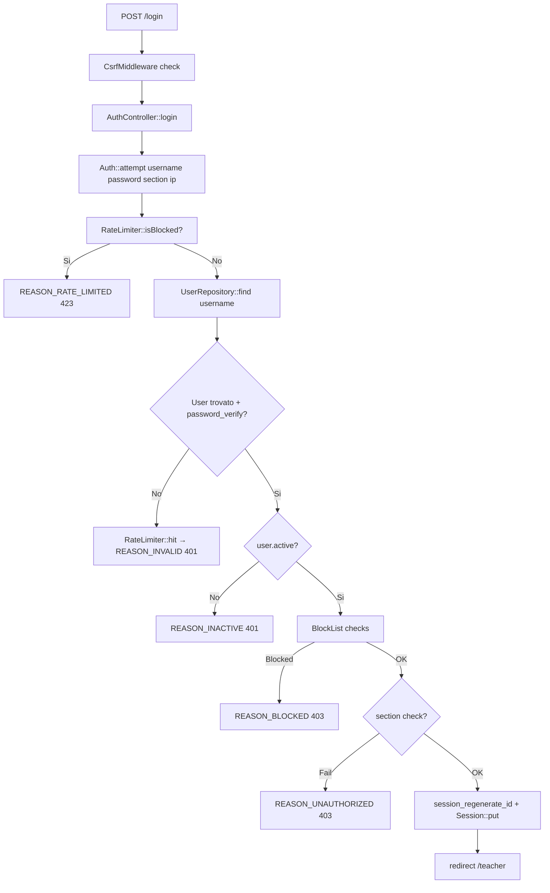

---
tags:
  - documentazione/architettura
  - dominio/auth
date: 2026-04-23
tipo: architettura
status: finale
aliases: ["auth", "autenticazione"]
cssclasses: []
---

# Dominio: auth

> [!abstract] Scopo
> Login/logout, gestione sessioni, registrazione self-service, RBAC (role-based access control), blocklist, student credential grant.

## Confini del dominio

- **In**: credenziali utente (username/password), richieste HTTP
- **Out**: sessione autenticata, redirect, JSON user info

## Moduli interni

| Modulo | File | Responsabilità |
|--------|------|----------------|
| AuthController | `app/Controllers/AuthController.php` | showLogin, login, logout, userInfo, csrf |
| RegistrationController | `app/Controllers/RegistrationController.php` | showForm, submit, listPending, approve, reject |
| UserProfileController | `app/Controllers/UserProfileController.php` | showChangePassword, changePassword |
| TeacherCredentialController | `app/Controllers/TeacherCredentialController.php` | Credenziali studente: index, create, delete, toggle, studentLogin, studentLogout, studentStatus |
| Auth | `app/Core/Auth.php` | Logica auth: attempt, check, role, hasAccess, isSuperAdmin, logout, sectionFromUrl |
| UserRepository | `app/Repositories/UserRepository.php` | CRUD utenti da DB (Phase 18: solo DB, JSON archiviati) |
| User | `app/Domain/User.php` | Entità: username, passwordHash, role, active, canAccessSection, verifyPassword |
| Role | `app/Domain/Role.php` | PHP 8.3 Enum: STUDENT, TEACHER, COLLABORATOR, ADMINISTRATOR |
| BlockList | `app/Services/BlockList.php` | Blocklist credential e IP per sezione |
| RateLimiter | `app/Services/RateLimiter.php` | Sliding window rate limit login |
| RegistrationService | `app/Services/RegistrationService.php` | Logica registrazione, validazione, hashing |
| RegistrationMailer | `app/Services/RegistrationMailer.php` | Email notifica admin + utente |
| AclPolicy | `app/Services/AclPolicy.php` | Policy ACL avanzate (super-admin, ownership check) |
| OwnershipService | `app/Services/OwnershipService.php` | Gestione tabella `ownership` |

## Flusso login



## Role hierarchy

```
guest(0) < student(10) < teacher(40) < collaborator(50) < administrator(100)
```

`is_super_admin`: flag ortogonale, bypass zona `admin` indipendentemente dal role.

## API pubblica

- `Auth::check()` — bool
- `Auth::attempt(username, password, section?, ip?)` — `[?User, ?reason]`
- `Auth::role()` — string
- `Auth::hasRole(...$roles)` — bool
- `Auth::hasAccess(zone)` — bool (usa `roles.access_zones`)
- `Auth::isSuperAdmin()` — bool (cache sessione)
- `Auth::refreshCurrentUserClaims()` — forza reload da DB
- `Auth::logout()` → `Session::destroy()`

## Dipendenze

- **core**: Session, Config, Database, Csrf, Response
- **nessuna dipendenza** da altri domini applicativi

## Link correlati

[[security-notes]] · [[routing-and-api]] · [[domains/core/core-overview]]
