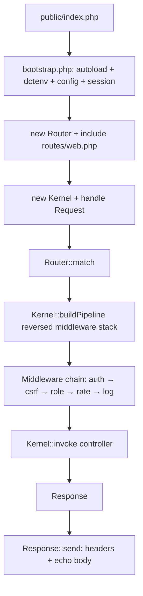

---
tags:
  - documentazione/architettura
  - dominio/core
date: 2026-04-23
tipo: architettura
status: finale
aliases: ["core"]
cssclasses: []
---

# Dominio: core

> [!abstract] Scopo
> Framework PHP custom: routing, middleware pipeline, request/response cycle, config, sessioni, DB, logging. Base di tutto il sistema.

## Confini del dominio

- **In**: ogni richiesta HTTP
- **Out**: `Response` verso client; `Config` e `Session` verso tutti i domini

## Moduli interni

| Modulo | File | Responsabilità |
|--------|------|----------------|
| Router | `app/Core/Router.php` | Registrazione route, match path+method, `{param}` pattern |
| Route | `app/Core/Router.php` (inner) | Entità route: methods, pattern, handler, middleware, params |
| Kernel | `app/Core/Kernel.php` | Middleware pipeline builder, invoke handler, error catch |
| Request | `app/Core/Request.php` | Wrappa `$_SERVER`, `$_GET`, `$_POST`, `$_FILES` |
| Response | `app/Core/Response.php` | Factory: `::json()`, `::html()`, `::file()`. `send()` emette headers+body |
| Auth | `app/Core/Auth.php` | `check()`, `attempt()`, `role()`, `hasAccess()`, `isSuperAdmin()`, `logout()` |
| Csrf | `app/Core/Csrf.php` | `token()`, `verify()`, `rotate()` — TTL-based, store in sessione |
| Session | `app/Core/Session.php` | Wrapper `$_SESSION`: `start()`, `get()`, `put()`, `destroy()` |
| Config | `app/Core/Config.php` | `load(dir)`, `get('section.key', $default)` — carica file PHP in `app/Config/` |
| Database | `app/Core/Database.php` | Singleton PDO, `isAvailable()`, dual-mode enabled/disabled |
| DbSessionHandler | `app/Core/DbSessionHandler.php` | Sessione DB-backed (opzionale) |
| View | `app/Core/View.php` | `render('template', $data)` — PHP template puro in `views/` |
| Migrator | `app/Core/Migrator.php` | Esegue SQL migrations da `database/migrations/` |
| AccessLogger | `app/Core/AccessLogger.php` | Log accessi in `storage/logs/access_log.json` |
| JsonLogger | `app/Core/Logger/JsonLogger.php` | PSR-3 logger, output JSON strutturato |
| Container | `app/Core/Container.php` | DI container leggero — non usato pervasivamente |
| Contracts | `app/Core/Contracts/` | Interfacce: `AuthInterface`, `ConfigInterface`, `DatabaseInterface` |
| Gateways | `app/Core/Gateway/` | Adapter per test: `AuthGateway`, `ConfigGateway`, `DatabaseGateway` |

## Middleware

| File | Alias | Funzione |
|------|-------|---------|
| `AuthMiddleware.php` | `auth` | Verifica `Auth::check()` |
| `RoleMiddleware.php` | `role` | Verifica `Auth::hasRole($roles)` |
| `CsrfMiddleware.php` | `csrf` | Verifica CSRF token |
| `RateLimitMiddleware.php` | `rate` | Sliding window rate limit |
| `AccessLogMiddleware.php` | `log` | Log request in access_log.json |
| `LegacyGoneMiddleware.php` | `legacy_gone` | 410 + redirect smart |
| `SuperAdminAuditMiddleware.php` | `sadmin_audit` | Audit trail super-admin |

## Support

| File | Funzione |
|------|---------|
| `app/Support/SafePath.php` | Path traversal prevention |
| `app/Support/Validator.php` | Input validation |
| `app/Support/Ulid.php` | ULID generator |
| `app/Support/BodyExtractor.php` | Estrae body da request |
| `app/Support/MimeSniffer.php` | Detect MIME type da contenuto |
| `app/Support/ViteManifest.php` | Legge `public/build/manifest.json` (TODO: integrazione) |
| `app/Support/helpers.php` | Helper globali (`e()`, `config()`, ecc.) |
| `app/Support/Storage/` | `LocalStorageProvider`, `S3CompatibleStorageProvider`, `StorageFactory` |

## Flusso principale

## API pubblica verso altri domini

- `Auth::check()`, `Auth::role()`, `Auth::hasRole()`, `Auth::hasAccess()`, `Auth::isSuperAdmin()` — usati da tutti i controller
- `Config::get(key, default)` — usato ovunque
- `Session::get()`, `Session::put()` — usato da Auth, controller
- `Database::connection()` — usato da Repository
- `Response::json()`, `Response::html()` — usato da tutti i controller
- `SafePath` — usato da FileController, TikzController

## Link core wiki

[[architecture]] · [[routing-and-api]] · [[security-notes]] · [[technical-debt]]
