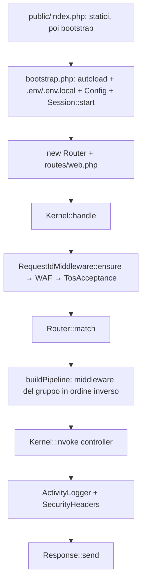

---
tags:
  - documentazione/architettura
  - dominio/core
date: 2026-09-04
tipo: architettura
status: finale
aliases: ["core"]
cssclasses: []
---

# Dominio: core

> [!abstract] Scopo
> Framework PHP custom: routing, pipeline di middleware, ciclo request/response, config, sessioni, DB, migrazioni, logging. Base di tutto il sistema.

## Confini del dominio

- **In**: ogni richiesta HTTP; i tool CLI che includono `app/bootstrap.php`
- **Out**: `Response` verso il client; `Config`, `Session`, `Database` verso tutti i domini

## Moduli interni

| Modulo | File | Responsabilità |
|--------|------|----------------|
| Router | `app/Core/Router.php` | registrazione rotte e gruppi (`prefix`, `middleware`), match path + metodo |
| Route | `app/Core/Route.php` | entità rotta: metodi, pattern `{param}`, `{param?}`, `{param*}`, handler, middleware, regex compilata lazy |
| Kernel | `app/Core/Kernel.php` | X-Request-ID, preload curriculum, rotazione log, WAF, gate ToS, pipeline di gruppo, registro delle operazioni, security header, catch globale |
| Request | `app/Core/Request.php` | wrappa `$_SERVER`, `$_GET`, `$_POST`, header; `input()`, `wantsJson()` |
| Response | `app/Core/Response.php` | factory `json()`, `html()`, `redirect()`, `file()`; `withETag()`, `withNoCache()`; `send()` (il ramo `.php` di `serveFile` esegue file legacy con `require`) |
| Auth | `app/Core/Auth.php` | `check()`, `attempt(establishSession)`, `establishSession()`, `role()`, `hasAccess()`, `isSuperAdmin()`, `actorRole()`, `currentInstitute()`, `setCurrentInstitute()` |
| Csrf | `app/Core/Csrf.php` | token TTL in sessione: `token()`, `verify()`, `rotate()` |
| Session | `app/Core/Session.php` | `start()` (handler DB se esiste `sessions`), timeout, rotazione id, `close()` per richieste lunghe |
| Config | `app/Core/Config.php` | `load(dir)`, `get('section.key')`, `set()` (solo test) |
| Database | `app/Core/Database.php` | singleton PDO; `connection()`, `maintenanceConnection()`, `migrationConnection()` (tre utenti) |
| DbSessionHandler | `app/Core/DbSessionHandler.php` | sessioni in tabella |
| Migrator | `app/Core/Migrator.php` | migrazioni SQL: tracking, advisory lock, splitter reale degli statement, statement saltati visibili, prefissi doppi rifiutati |
| View | `app/Core/View.php` | `render('template', $data)` con variabili prefissate `__` per evitare collisioni |
| AccessLogger, PrivilegedAccessLogger | `app/Core/AccessLogger.php`, `PrivilegedAccessLogger.php` | `access_log.json` (storico; dal 2026-09-23 impronta della sessione, non l'id: [[security-notes]]) e `privileged_access_log` |
| Telemetry, Span | `Telemetry.php`, `Span.php`, `NoopSpan.php` | span opzionali (`TELEMETRY_ENABLED`) |

Rimossi il 2026-09-04: `Container`, `Contracts/`, `Gateway/` (usati solo dal
proprio test) e `TenantMiddleware` (mai attaccato a una rotta).

## Middleware (`app/Middleware/`)

Questa tabella è l'elenco degli alias: le altre pagine rimandano qui (una
regola in un posto solo). La mappa vera è `Kernel::$middlewareMap`.

| File | Alias | Funzione |
|------|-------|---------|
| `AuthMiddleware.php` | `auth` | sessione; confinamento a cambio password o iscrizione 2FA |
| `RoleMiddleware.php` | `role:<zona>` | `Auth::hasAccess()` |
| `StudioMiddleware.php` | `studio` | studente con account, oppure ospite con credenziale di classe valida |
| `CsrfMiddleware.php` | `csrf` | token su POST/PUT/PATCH/DELETE |
| `RateLimitMiddleware.php` | `rate[:bucket,N]` | finestra scorrevole |
| `AccessLogMiddleware.php` | `log` | `access_log.json` |
| `LegacyGoneMiddleware.php` | `legacy_gone` | 410 + redirect |
| `SuperAdminAuditMiddleware.php` | `sadmin_audit:<azione>,<risorsa>` | letture privilegiate a registro |
| `RequiresAuditReasonMiddleware.php` | `audit_reason` | motivazione 10-255 caratteri |
| `SuperAdminRequiredMiddleware.php` | `super_admin_required` | gate super-admin |
| `TeacherSubjectsMiddleware.php` | `teacher_subjects` | materie dichiarate al primo accesso |
| `WafMiddleware.php` | `waf` (globale) | WAF applicativo |
| `TosAcceptanceMiddleware.php` | — (globale) | gate ToS/AUP |
| `SecurityHeadersMiddleware.php` | — (globale) | CSP, HSTS, ecc. |
| `RequestIdMiddleware.php` | — (`ensure()` dal Kernel) | X-Request-ID |

## Support (`app/Support/`)

| File | Funzione |
|------|---------|
| `DeploymentScenario.php`, `DeploymentMode.php`, `StudentRegistration.php` | scenario di esercizio (ADR-032) e flag legacy allineati; override in `storage/config` |
| `ClassAccessGrant.php` | grant della credenziale di classe in sessione |
| `TwoFactorEnforcement.php`, `TosEnforcement.php` | obblighi 2FA e ToS con override runtime |
| `SostituzioneSuFile.php` | la meccanica comune dei cinque override di `storage/config`: percorso, cache per richiesta, scrittura atomica; un file corrotto vale come assente e scrive l'anomalia `sostituzione_illeggibile` (23/9/2026, A-38) |
| `CurriculumLookup.php`, `IndirizzoCodeDeriver.php`, `MiurCurriculumAlias.php`, `ClsNormalizer.php` | codici e label del curriculum per istituto |
| `TeacherContextResolver.php`, `AuthHelpers.php` | docente corrente, istituto attivo e casa dei file privati (vedi [[glossary]]) |
| `SafePath.php`, `Validator.php`, `MimeSniffer.php`, `BodyExtractor.php`, `Ulid.php` | validazioni e utilità |
| `ViteManifest.php`, `CriticalCss.php`, `StandalonePageRenderer.php` | asset e pagine standalone |
| `Storage/` | `LocalStorageProvider`, `S3CompatibleStorageProvider`, `StorageFactory`, `PutResult` |
| `Repository.php`, `TransactionRunner.php`, `PdoTransactionRunner.php` | base CRUD e transazioni rientranti |
| `BundlePathBuilder.php` | path dei bundle di export |
| `helpers.php` | `e()`, `config()`, `base_path()`, `storage_path()` (`env()` è tolto dal 23/9/2026: l'ambiente si legge in `app/Config`, ADR-049) |

## Flusso principale

```mermaid
flowchart TD
    A[public/index.php: statici, poi bootstrap] --> B[bootstrap.php: autoload + .env/.env.local + Config + Session::start]
    B --> C[new Router + routes/web.php]
    C --> D[Kernel::handle]
    D --> E[RequestIdMiddleware::ensure → WAF → TosAcceptance]
    E --> F[Router::match]
    F --> G[buildPipeline: middleware del gruppo in ordine inverso]
    G --> H[Kernel::invoke controller]
    H --> I[ActivityLogger + SecurityHeaders]
    I --> J[Response::send]
```

## API pubblica verso altri domini

- `Auth::check()`, `role()`, `hasRole()`, `hasAccess()`, `isSuperAdmin()`, `actorRole()`, `currentInstitute()`
- `Config::get(key, default)`
- `Session::get()`, `put()`, `forget()`, `close()`
- `Database::connection()` (e le due connessioni speciali per tool)
- `Response::json()`, `html()`, `redirect()`
- `SafePath`, `Validator`, `Ulid`

## Link core wiki

[[architecture]] · [[routing-and-api]] · [[security-notes]] · [[technical-debt]]
