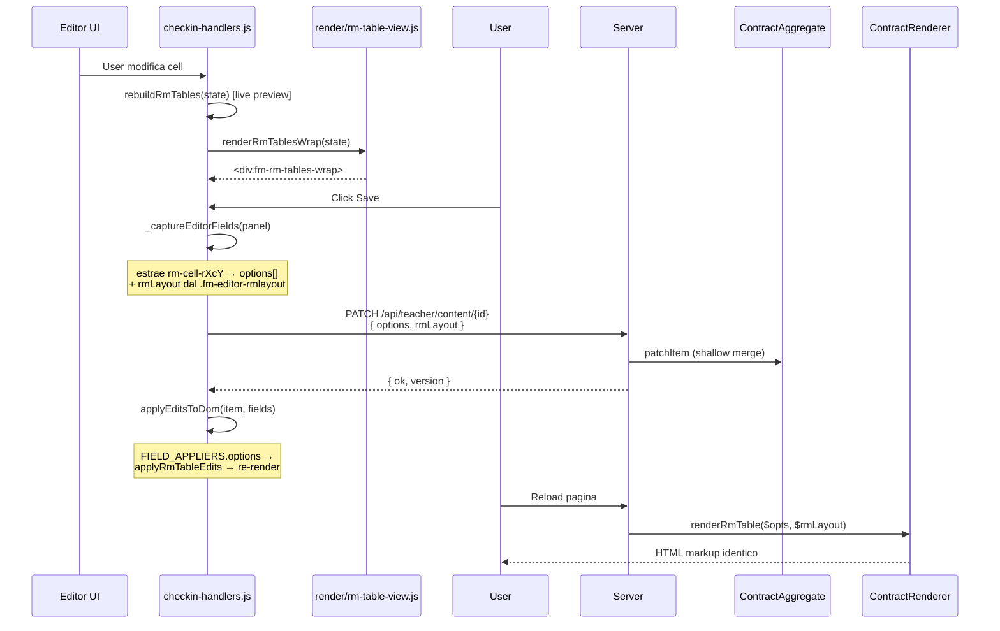

---
tags:
  - documentazione/dominio
  - esercizi
date: 2026-05-12
tipo: dominio
status: finale
aliases: ["rm-table", "tabella-rm", "rmulti"]
---

# Rendering tabelle RM (Risposta Multipla) — G23

> [!info] Piano completo: [`docs/plans/G23-rm-table-unification.md`](../../../docs/plans/G23-rm-table-unification.md)
> Changelog: [[changelog/2026-05]] § 2026-05-12.

## Architettura

Le tabelle RM hanno **tre renderer paralleli** che devono produrre output
coerente:

1. **Client preview** — `js/modules/render/rm-table-view.js`
2. **Server HTML** — `App\Services\ContractRenderer::renderRmTable()`
3. **TeX/PDF** — `App\Services\TexBuilder\Sanitizer::convertRmTable()`

Tutti i renderer derivano dalle stesse **definizioni centralizzate** dei
tipi colonna:

- JS: `COL_TYPES` esportato da `render/rm-table-view.js`
- PHP: `App\Services\Rendering\RmColumnTypes`

## Schema contract

```jsonc
{
  "type": "type_RMulti",
  "items": [{
    "options": [
      { "letter": "a", "correct": false, "content": [/* blocks */] },
      { "letter": "b", "correct": true,  "content": [/* blocks */] }
    ],
    "rmLayout": {
      "rows": 2,                // dimensione esplicita matrice
      "cols": 2,
      "typecell": "|X|V|X|V|",  // tipi per-colonna (X/V/B/T/N)
      "mixtr": false,           // mix ordine righe
      "mixcol": false,          // mix ordine colonne
      "mpagew": true,           // larghezza piena (\linewidth)
      "specificWidth": ""       // override px (es. "300")
    }
  }]
}
```

## Tipi colonna

| Type | HTML | TeX | Descrizione |
|------|------|-----|-------------|
| `X`  | `<input type="checkbox" class="checkbox checkboxRM">` | `\square`   | Checkbox (selezione multipla) |
| `V`  | `<input type="radio"    class="checkbox checkboxRM">` | `\bigcirc`  | Radio (selezione esclusiva)   |
| `B`  | `<button class="rm-btn">btn</button>`                 | `\fbox{btn}`         | Button clickabile             |
| `T`  | `<input type="text" class="rm-text">`                 | `\underline{\ \ \ \ }` | Input testuale                |
| `N`  | `<input type="number" class="rm-num">`                | `\boxed{\#}`         | Input numerico                |

Nota: il `<button class="rm-btn">` è preservato dal Sanitizer durante lo
strip generale dei button (UI residue DSA) tramite check di classe.

## Markup HTML canonico

```html
<table class="rm-table"
       data-typecell="|X|V|"
       data-rows="2" data-cols="2"
       data-mixtr="0" data-mixcol="0"
       data-mpagew="1">
  <tbody>
    <tr>
      <td class="rm-option" data-row="0" data-col="0">
        <div class="wrapCheckCell">
          <input type="checkbox" class="checkbox checkboxRM">
          <label class="collex">
            <div class="cellContent">{blocks rendered}</div>
          </label>
        </div>
      </td>
      <!-- ... -->
    </tr>
  </tbody>
</table>
```

**Importante**: nessun `<span class="rm-letter">a.</span>` decorativo.
Le lettere `a/b/c/d` sono derivate **solo nel TeX builder**
(`Sanitizer::convertRmTable()`) dall'indice cella:

```php
$letter = chr(97 + $globalCellIdx % 26) . '.';
```

## Flusso save/edit



## Test

- Unit PHP: `tests/Unit/Services/ContractRendererRmTest.php`
- Unit PHP: `tests/Unit/TexBuilderTest.php::rmulti_*`
- E2E: `tests/e2e/g23_rm_table_unification.spec.js`

## Vincoli & note

- **`syncCellsShape`** preserva contenuti esistenti quando rows/cols
  cambiano in editor live.
- **`extractCellContent`** è agnostic al markup: gestisce sia legacy
  `.rm-letter/.rm-pick-choice` (contract antichi) sia moderno
  `.wrapCheckCell > input + label.collex > .cellContent`.
- **Backward-compat**: contract senza `rmLayout` cadono in fallback
  auto-chunk (≤4 short opts → 1×N, altrimenti 2×N). Vedi
  `ContractRenderer::renderRmTable()` per dettagli.
