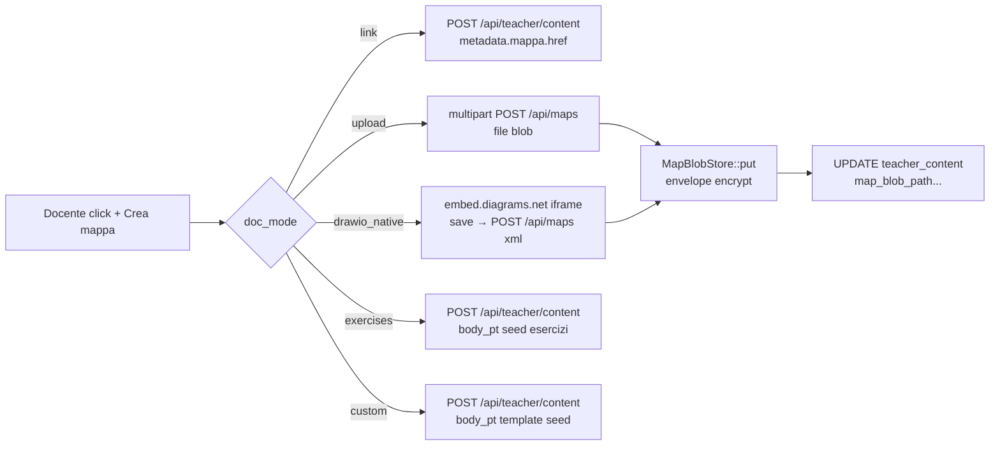
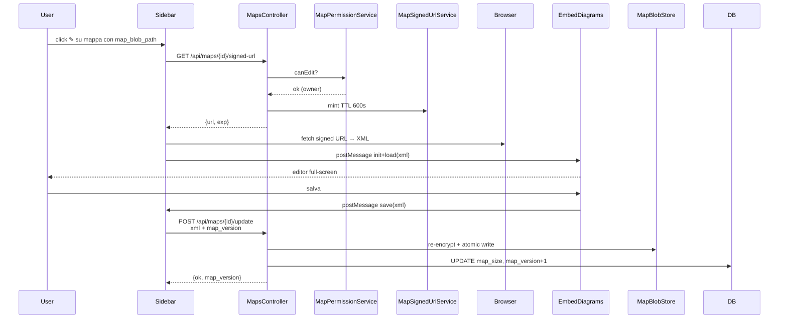

---
tags:
  - documentazione/architettura
  - dominio/mappe
date: 2026-04-29
tipo: architettura
status: finale
aliases: ["mappe", "mappe concettuali", "drive integration"]
cssclasses: []
---

# Dominio: mappe

> [!abstract] Scopo
> Mappe concettuali (drawio XML, PDF, PNG, HTML) con storage locale cifrato envelope, integrazione Google Drive bidirezionale (push only — server e' single source of truth), modifica in-app via embed.diagrams.net. **Sostituisce** il flusso legacy `scriptGoogle_sync` (Google Apps Script polling Drive→FTP) deprecato post-G6.

## Confini del dominio

- **In**: docente autenticato, file mappa (upload, drawio editor, link URL), Google OAuth, blob locale
- **Out**: signed URL per visualizzazione/modifica, Drive file ID per copia secondaria, link condivisione granulare

## Moduli interni

| Modulo | File | Responsabilità |
|--------|------|----------------|
| MapsController | `app/Controllers/MapsController.php` | REST CRUD mappe + sync + signed URL + download |
| DriveController | `app/Controllers/DriveController.php` | OAuth flow (connect/callback/status/disconnect/connect-migration) |
| DriveClient | `app/Services/Drive/DriveClient.php` | Wrapper google/apiclient (auth URL, exchange, refresh) |
| DriveOAuthRepository | `app/Repositories/DriveOAuthRepository.php` | Persistence refresh_token cifrato (envelope ADR-006) |
| FolderTreeBuilder | `app/Services/Drive/FolderTreeBuilder.php` | Risolve cartella Drive target con cache |
| MapSyncService | `app/Services/Drive/MapSyncService.php` | Push DB → Drive idempotent (syncOne/syncAllForTeacher) |
| MapBlobStore | `app/Services/Maps/MapBlobStore.php` | Storage `storage/maps_enc/{tid}/{ulid}.bin` cifrato envelope |
| MapPermissionService | `app/Services/Maps/MapPermissionService.php` | canView/canCopy/canEdit con priority + context |
| MapShareRepository | `app/Repositories/MapShareRepository.php` | Sharing granulare cross-teacher/class/student/institute |
| MapSignedUrlService | `app/Services/Maps/MapSignedUrlService.php` | HMAC TTL token per accesso blob |
| Frontend modal | `js/modules/features/sidepage-modal-content.js` | Create modal con 5 modalità unificate |
| Drawio editor | `js/modules/features/drawio-editor.js` | Embed iframe overlay full-screen (lazy import) |
| Sync buttons | `js/modules/features/drive-sync-buttons.js` | UI sync globale + per-item (data-state) |

## Schema DB

| Tabella | Scopo |
|---------|-------|
| `teacher_content` (content_type='mappa') | Riga mappa con metadata + colonne `map_*` (blob_path, mime, size, drive_id, origin, is_public, version) |
| `map_shares` | Grant cross-teacher/class/student/institute con permission view/copy |
| `teacher_drive_oauth` | Refresh token cifrato envelope (TKEK ADR-006) per docente |
| `teacher_drive_folder_cache` | Cache (teacher_id, folder_path) → drive_folder_id |

## Flusso creazione mappa (5 modalità unificate)



## Flusso modifica drawio in-app



## Flusso sync DB → Drive

```mermaid
flowchart TB
    Trigger{Trigger}
    Trigger -->|click ☁ globale| A1[POST /api/maps/sync-all]
    Trigger -->|click ☁ per-item| A2[POST /api/maps/{id}/sync]
    Trigger -->|cron notturno| A3[php drive_sync_nightly.php]
    A1 --> S[MapSyncService.syncAllForTeacher]
    A2 --> O[MapSyncService.syncOne]
    A3 --> S
    S --> O
    O --> P[FolderTreeBuilder.resolve]
    P --> Q[Drive API files.create OR files.update]
    Q --> R[UPDATE map_drive_id<br>touch last_sync_at]
```

## Endpoint REST

Vedi [[routing-and-api]] per la tabella completa.

| Method | Path | Auth | Note |
|--------|------|------|------|
| GET | `/teacher/drive/connect` | auth+teacher | OAuth scope drive.file (operativo) |
| GET | `/teacher/drive/connect-migration` | auth+teacher | OAuth scope drive.readonly (G6 una tantum) |
| GET | `/teacher/drive/callback` | auth+teacher | Callback consent (state nonce) |
| GET | `/teacher/drive/status.json` | auth+teacher | Stato pill UI |
| POST | `/teacher/drive/disconnect` | auth+teacher+csrf | Crypto-shred refresh token |
| POST | `/api/maps` | auth+teacher+csrf+rate | Crea mappa upload o drawio_native |
| GET | `/api/maps/{id}/signed-url` | auth+teacher | Mint URL TTL 600s |
| GET | `/api/maps/dl` | public (HMAC=auth) | Stream blob decifrato |
| POST | `/api/maps/{id}/update` | auth+teacher+csrf+rate | Save da editor (owner only, optimistic concurrency) |
| POST | `/api/maps/{id}/sync` | auth+teacher+csrf+rate | Sync singola mappa (owner only) |
| POST | `/api/maps/sync-all` | auth+teacher+csrf+rate:30 | Batch sync teacher |

## Sicurezza

### Envelope encryption (ADR-006)

Ogni blob mappa cifrato AES-256-GCM con TKEK derivato HKDF da `KMS_MASTER_KEY` per teacher_id. Layout binario file:

```
[2B kv][12B IV][16B GCM tag][N B ciphertext]
```

**Crypto-shredding O(1)**: DELETE `teacher_keys` row → tutti i `map_blob_path` del docente unreadable senza dover toccare il filesystem (Art. 17 GDPR efficiente).

### Path traversal

`MapBlobStore::guardPath` regex strict `^\d+/[0-9A-Z]{26}\.bin$` (ULID Crockford bypass-safe).

### OAuth scope minimale

Default `drive.file`: read+write SOLO file creati dall'app. Privacy by design (Art. 5 §1c GDPR).

`drive.readonly` SOLO via `/teacher/drive/connect-migration` per fase G6 (download legacy mappe pre-esistenti). Post-migrazione il docente declassa via `/teacher/drive/connect`.

### Refresh token

Salvato cifrato envelope nel DB. MAI in chiaro su disco/log/backup. Disconnect = DELETE row → token unreadable, idempotent.

### Optimistic concurrency

`map_version` incrementato a ogni save. Mismatch client/server → 409 (UI prompt reload, no lost-update).

### Signed URL

HMAC-SHA256 su payload `{i:content_id, m:mode, e:exp}` base64url. TTL clamp [60, 3600], default 600. Permission check al MINT (server-side), URL pre-autorizzato (pattern S3 presigned).

## Sharing granulare

`map_shares` tabella con scope_type ∈ {institute, class, student, teacher} + permission ∈ {view, copy}:

- `view`: signed URL read-only
- `copy`: viewer puo' aprire embed editor in modalita' copia → save genera **nuova row** `teacher_content` con `parent_map_id` (originale intoccato)

Default = no row → no cross-teacher access (diritto autore).

`MapPermissionService::canView` accetta `?array $context = ['institute_id', 'indirizzo', 'classe']` opzionale per studenti loggati via `teacher_access_credentials`. Senza context → class-scope grants ignorati.

## Migrazione legacy (G6)

`tools/migrations/migrate_drive_mappe_to_local.php`:
- 212 mappe legacy in DB Phase 18 (link only, drawio_id Drive)
- Re-consent UNA TANTUM con scope `drive.readonly`
- Download via Drive `files.get(drawio_id, alt=media)` → cifra envelope → save blob
- Failure 404/403 → `map_origin='drive_orphan'` con drive_id preserved (link `viewer.diagrams.net` continua funzionante in modalità degraded)
- Resume-safe: skip se `map_blob_path` già valorizzato

## Deprecazione scriptGoogle_sync

`scriptGoogle_sync/` (Google Apps Script polling Drive→FTP→`.json`) è in deprecazione completa post-G7. Cartella spostata in `docs/archive/scriptGoogle_sync-deprecated/` con README di puntamento al sistema nuovo. Vedi [[decisions/ADR-009-drive-integration]] per il razionale completo.

## Riferimenti

- [[decisions/ADR-009-drive-integration]] — decisione architetturale completa
- [[decisions/ADR-006-envelope-encryption]] — envelope crypto riusato
- [[decisions/ADR-008-audit-reason]] — audit log cross-teacher access
- [[security-notes]] — overview sicurezza GDPR
- [[changelog]] — entries dettagliate G1.a → G7
