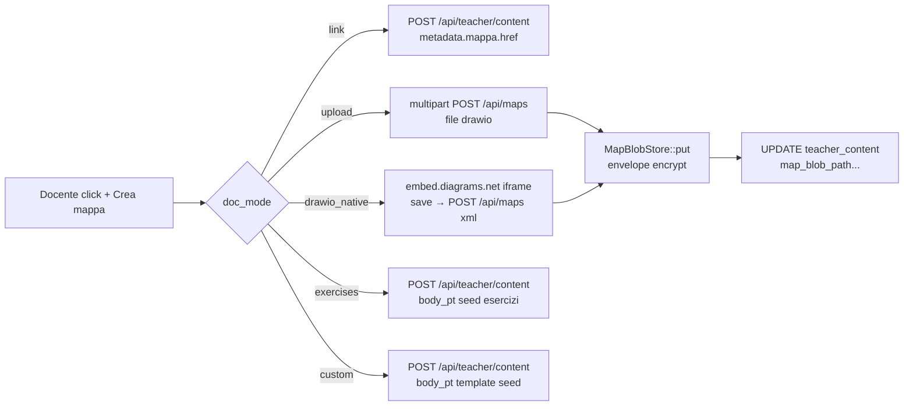
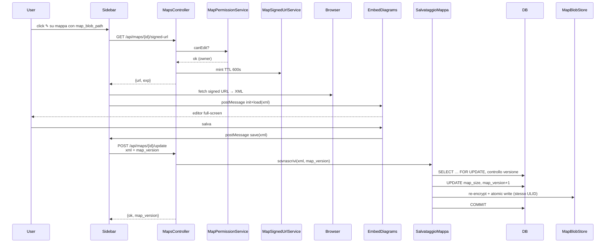

---
tags:
  - documentazione/architettura
  - dominio/mappe
date: 2026-04-29
tipo: architettura
status: finale
aliases: ["mappe", "mappe concettuali", "drive integration"]
cssclasses: []
---

# Dominio: mappe

> [!abstract] Scopo
> Mappe concettuali drawio (XML) con storage locale cifrato envelope, integrazione Google Drive bidirezionale (push only — server e' single source of truth), modifica in-app via embed.diagrams.net. **Sostituisce** il flusso legacy `scriptGoogle_sync` (Google Apps Script polling Drive→FTP) deprecato post-G6.

## Confini del dominio

- **In**: docente autenticato, file mappa (upload, drawio editor, link URL), Google OAuth, blob locale
- **Out**: signed URL per visualizzazione/modifica, Drive file ID per copia secondaria, link condivisione granulare

## Moduli interni

| Modulo | File | Responsabilità |
|--------|------|----------------|
| MapsController | `app/Controllers/MapsController.php` | REST CRUD mappe + sync + signed URL + download |
| DriveController | `app/Controllers/DriveController.php` | OAuth flow (connect/callback/status/disconnect/connect-migration) |
| DriveClient | `app/Services/Drive/DriveClient.php` | Wrapper google/apiclient (auth URL, exchange, refresh) |
| DriveOAuthRepository | `app/Repositories/DriveOAuthRepository.php` | Persistence refresh_token cifrato (envelope ADR-006) |
| FolderTreeBuilder | `app/Services/Drive/FolderTreeBuilder.php` | Risolve cartella Drive target con cache |
| MapSyncService | `app/Services/Drive/MapSyncService.php` | Push DB → Drive idempotent (syncOne/syncAllForTeacher) |
| MapBlobStore | `app/Services/Maps/MapBlobStore.php` | Storage `storage/maps_enc/{tid}/{ulid}.bin` cifrato envelope |
| SalvataggioMappa | `app/Services/Maps/SalvataggioMappa.php` | Sovrascrive il disegno con il controllo di versione (editor e strumento dei caratteri persi) |
| RipristinoCaratteri | `app/Services/Maps/RipristinoCaratteri.php` | Regole pure per rimettere le lettere accentate diventate «??» ([Caratteri persi](#caratteri-persi-origine-e-strumento)) |
| RipristinoCaratteriMappe | `app/Services/Maps/RipristinoCaratteriMappe.php` | Censimento, prova a secco e scrittura del ripristino sul server |
| PreparazioneRipristino | `app/Services/Maps/PreparazioneRipristino.php` | In locale: dal censimento e dagli originali del Drive, la patch e l'elenco da rivedere |
| MapPermissionService | `app/Services/Maps/MapPermissionService.php` | canView/canCopy/canEdit con priority + context |
| MapShareRepository | `app/Repositories/MapShareRepository.php` | Sharing granulare cross-teacher/class/student/institute |
| MapSignedUrlService | `app/Services/Maps/MapSignedUrlService.php` | HMAC TTL token per accesso blob |
| Frontend modal | `js/modules/features/sidepage-modal-content.js` | Create modal con 5 modalità unificate |
| Drawio editor | `js/modules/features/drawio-editor.js` | Embed iframe overlay full-screen (lazy import) |
| Sync buttons | `js/modules/features/drive-sync-buttons.js` | UI sync globale + per-item (data-state) |

## Schema DB

| Tabella | Scopo |
|---------|-------|
| `teacher_content` (content_type='mappa') | Riga mappa con metadata + colonne `map_*` (blob_path, mime, size, drive_id, origin, is_public, version) |
| `map_shares` | Grant cross-teacher/class/student/institute con permission view/copy |
| `teacher_drive_oauth` | Refresh token cifrato envelope (TKEK ADR-006) per docente |
| `teacher_drive_folder_cache` | Cache (teacher_id, folder_path) → drive_folder_id |

## Flusso creazione mappa (5 modalità unificate)


```mermaid
flowchart LR
    A[Docente click + Crea mappa] --> B{doc_mode}
    B -->|link| C[POST /api/teacher/content<br>metadata.mappa.href]
    B -->|upload| D[multipart POST /api/maps<br>file drawio]
    B -->|drawio_native| E[embed.diagrams.net iframe<br>save → POST /api/maps xml]
    B -->|exercises| F[POST /api/teacher/content<br>body_pt seed esercizi]
    B -->|custom| G[POST /api/teacher/content<br>body_pt template seed]
    D --> H[MapBlobStore::put<br>envelope encrypt]
    E --> H
    H --> I[UPDATE teacher_content<br>map_blob_path...]
```

La sezione della barra in cui nasce la mappa (`section_key`) si cerca
nell'**istituto attivo**, come per `POST /api/teacher/content`: per un
docente di due scuole è quella del selettore (vedi [[glossary]]). Fino al
23/9/2026 `POST /api/maps` la cercava nella prima scuola, e con la seconda
attiva la mappa nasceva senza sezione (A-7).

## Flusso modifica drawio in-app


```mermaid
sequenceDiagram
    User->>Sidebar: click ✎ su mappa con map_blob_path
    Sidebar->>MapsController: GET /api/maps/{id}/signed-url
    MapsController->>MapPermissionService: canEdit?
    MapPermissionService-->>MapsController: ok (owner)
    MapsController->>MapSignedUrlService: mint TTL 600s
    MapsController-->>Sidebar: {url, exp}
    Sidebar->>Browser: fetch signed URL → XML
    Sidebar->>EmbedDiagrams: postMessage init+load(xml)
    EmbedDiagrams-->>User: editor full-screen
    User->>EmbedDiagrams: salva
    EmbedDiagrams->>Sidebar: postMessage save(xml)
    Sidebar->>MapsController: POST /api/maps/{id}/update<br>xml + map_version
    MapsController->>SalvataggioMappa: sovrascrivi(xml, map_version)
    SalvataggioMappa->>DB: SELECT … FOR UPDATE, controllo versione
    SalvataggioMappa->>DB: UPDATE map_size, map_version+1
    SalvataggioMappa->>MapBlobStore: re-encrypt + atomic write (stesso ULID)
    SalvataggioMappa->>DB: COMMIT
    MapsController-->>Sidebar: {ok, map_version}
```

## Flusso sync DB → Drive

```mermaid
flowchart TB
    Trigger{Trigger}
    Trigger -->|click ☁ globale| A1[POST /api/maps/sync-all]
    Trigger -->|click ☁ per-item| A2[POST /api/maps/{id}/sync]
    Trigger -->|cron notturno| A3[php drive_sync_nightly.php]
    A1 --> S[MapSyncService.syncAllForTeacher]
    A2 --> O[MapSyncService.syncOne]
    A3 --> S
    S --> O
    O --> P[FolderTreeBuilder.resolve]
    P --> Q[Drive API files.create OR files.update]
    Q --> R[UPDATE map_drive_id<br>touch last_sync_at]
```

## Endpoint REST

Vedi [[routing-and-api]] per la tabella completa.

| Method | Path | Auth | Note |
|--------|------|------|------|
| GET | `/teacher/drive/connect` | auth+teacher | OAuth scope drive.file (operativo) |
| GET | `/teacher/drive/connect-migration` | auth+teacher | OAuth scope drive.readonly (G6 una tantum) |
| GET | `/teacher/drive/callback` | auth+teacher | Callback consent (state nonce) |
| GET | `/teacher/drive/status.json` | auth+teacher | Stato pill UI |
| POST | `/teacher/drive/disconnect` | auth+teacher+csrf | Crypto-shred refresh token |
| POST | `/api/maps` | auth+teacher+csrf+rate | Crea mappa upload o drawio_native |
| GET | `/api/maps/{id}/signed-url` | auth+teacher | Mint URL TTL 600s |
| GET | `/api/maps/dl` | public (HMAC=auth) | Il file decifrato, come allegato `application/octet-stream` con nosniff |
| POST | `/api/maps/{id}/update` | auth+teacher+csrf+rate | Save da editor (owner only, optimistic concurrency) |
| POST | `/api/maps/{id}/sync` | auth+teacher+csrf+rate | Sync singola mappa (owner only) |
| POST | `/api/maps/sync-all` | auth+teacher+csrf+rate:30 | Batch sync teacher |

## Sicurezza

### Envelope encryption (ADR-006)

Ogni blob mappa cifrato AES-256-GCM con TKEK derivato HKDF da `KMS_MASTER_KEY` per teacher_id. Layout binario file:

```
[2B kv][12B IV][16B GCM tag][N B ciphertext]
```

**Crypto-shredding O(1)**: DELETE `teacher_keys` row → tutti i `map_blob_path` del docente unreadable (Art. 17 GDPR efficiente). Dal 2026-09-24 la cancellazione dell'account (`CancellazioneDellAccount`) toglie anche i blob da `maps_enc/<id>/` e `verifiche_enc/<id>/`: le copie fuori sede li tengono fra i «rimossi» per un anno, illeggibili quando nessuna copia contiene più la chiave.

### Il file della mappa: in ingresso, nella pagina, nel link firmato

Una mappa entra solo se il file è un XML drawio, e si salva come
`application/xml` (`App\Services\Maps\FileDrawio`). Lo controllano tutte le
strade da cui arriva un file: «Carica file» (`mode=upload`, 422
`drawio_non_valido`), l'import dei pacchetti
(`POST /api/teacher/import-bundle/apply` e `preview` con i file: la mappa non
si crea e il riepilogo la mette fra gli errori, `drawio_non_valido`), la
creazione e il salvataggio dall'editor (`drawio_native` e `update`, 422
`xml_invalid`, con `motivo` nel salvataggio) e il «Link esterno» di Drive
(`MappaDaLinkDrive`, 422 `drawio_non_valido`). Fino al
23/9/2026 «Carica file» guardava il nome e i primi 256 byte, e l'import
l'estensione del percorso: entravano PDF, PNG, JPEG e HTML, che nessuna pagina
mostrava (la pagina di studio e l'editor aprono solo drawio); un PDF mandava
in errore gli script di tutte le mappe del topic, e un HTML finiva dentro lo
script della pagina.

Che cosa passa, e perché così, lo dice il commento di `FileDrawio`: UTF-8,
nessuna dichiarazione XML di un'altra codifica, nessun DOCTYPE, XML ben formato
letto senza rete e senza DTD, radice `mxfile` o `mxGraphModel`, al più 64
livelli sotto la radice e 200.000 elementi (le 192 mappe della copia locale
arrivano a 5 e a 2.602). Si legge con `LIBXML_PARSEHUGE`, perché un'immagine
incorporata sopra i 10 MB sta in un attributo; e proprio per questo nessun DTD
deve arrivare a libxml, che con quell'opzione, nell'immagine del rilascio, non
ferma più la moltiplicazione delle entità, e i due tetti si contano sui byte
prima del DOM: PARSEHUGE toglie anche il limite di profondità di libxml, e 49
MB di `<a>` annidati portavano un processo a 3 GB.

La pagina di studio mette il file di ogni mappa, piccola o grande, in
un'isola JSON (`<script type="application/json" data-fm-mappe-xml>`),
codificato come dice [[security/xss-policy]] («Dati del server dentro uno
`<script>`»). Il pulsante «Scarica .drawio» e il visualizzatore delle grandi
(embed + `postMessage`) stanno nel bundle,
`js/modules/features/mappe-della-pagina.js`, e leggono l'isola quando servono
(al clic, all'`init` del visualizzatore): funzionano anche dopo una
navigazione del router SPA. Fino al 23/9/2026 (revisione architetturale A-19)
erano due `<script>` in linea scritti da `StudyPageRenderer`, ognuno con il
suo JSON. Il JSON codificato così pesa circa 1,96 volte il file (da 1,79 a
2,14; mediana delle 192 mappe della copia locale, 23/9/2026); con i due script
una mappa pesava nella pagina il doppio, circa 3,9 volte il file, e ora c'è
una volta sola. Prove: `tests/Integration/MappeNegliScriptDellaPaginaTest.php`,
`tests/js-unit/mappe-della-pagina.test.js` e, nel browser,
`tests/e2e/studio/mappe-della-pagina.spec.js`.

Il link firmato (`/api/maps/dl`) dà il file come allegato
`application/octet-stream`, con `X-Content-Type-Options: nosniff`, qualunque
sia `map_mime`: le righe vecchie `text/html` non si aprono come pagina del
sito, e nemmeno un drawio con uno `<script>` XHTML dentro. Chi lo usa lo legge
con `fetch` (l'editor, `drawio-editor.js`), e il tipo non cambia i byte.

Il recupero da Drive da riga di comando
(`tools/migrations/recupera_mappe_da_drive.php`) guarda ancora solo i primi
byte (`MapSyncService::tipoDelContenuto`), e lo strumento di ripristino dei
caratteri (`RipristinoCaratteri::siLeggeComeXml`) legge con `PARSEHUGE` senza
guardare DOCTYPE né codifica: li lancia un amministratore, su mappe che dal
23/9 sono entrate tutte da `FileDrawio`, ma non quelle salvate prima.

### Path traversal

`MapBlobStore::guardPath` regex strict `^\d+/[0-9A-Z]{26}\.bin$` (ULID Crockford bypass-safe).

### OAuth scope minimale

Default `drive.file`: read+write SOLO file creati dall'app. Privacy by design (Art. 5 §1c GDPR).

`drive.readonly` SOLO via `/teacher/drive/connect-migration` per fase G6 (download legacy mappe pre-esistenti). Post-migrazione il docente declassa via `/teacher/drive/connect`.

### Refresh token

Salvato cifrato envelope nel DB. MAI in chiaro su disco/log/backup. Disconnect = DELETE row → token unreadable, idempotent.

### Optimistic concurrency

`map_version` incrementato a ogni save. Mismatch client/server → 409 (UI prompt reload, no lost-update).

Dal 19/9/2026 il salvataggio sta in `SalvataggioMappa`: prima blocca la riga e
alza la versione, **poi** scrive il file. Prima era il contrario, e chi perdeva
la gara riceveva il 409 dopo aver già sovrascritto il file di chi l'aveva vinta.
La prova è `tests/Integration/SalvataggioMappaTest.php` (la riga tenuta da
un'altra connessione: il file non si tocca). Un `map_blob_path` nella cartella
di un altro docente non si scrive (`blob_path_invalid`): il file nuovo
finirebbe dove la riga non guarda. In produzione, il 19/9, nessuna riga era in
quella condizione.

Quello che l'ordine non chiude: il file si scrive dentro la transazione e il
commit viene dopo, quindi se a fallire è **il commit** (database riavviato,
`wait_timeout` scaduto) il disegno nuovo è già sul disco mentre `map_version` e
`map_size` tornano indietro — l'editor mostra «update_failed» e ricaricando si
vede il disegno nuovo con la versione vecchia. Finestra stretta, la richiude il
salvataggio successivo; l'ordine inverso sarebbe peggio (si tornerebbe a
sovrascrivere il lavoro di chi ha vinto la gara). Chi deve accorgersene
rilegge il blob e confronta lo sha256, come fa lo strumento dei caratteri
persi.

### Signed URL

HMAC-SHA256 su payload `{i:content_id, m:mode, e:exp}` base64url. TTL clamp [60, 3600], default 600. Permission check al MINT (server-side), URL pre-autorizzato (pattern S3 presigned).

## Sharing granulare

`map_shares` tabella con scope_type ∈ {institute, class, student, teacher} + permission ∈ {view, copy}:

- `view`: signed URL read-only
- `copy`: viewer puo' aprire embed editor in modalita' copia → save genera **nuova row** `teacher_content` con `parent_map_id` (originale intoccato)

Default = no row → no cross-teacher access (diritto autore).

`MapPermissionService::canView` accetta `?array $context = ['institute_id', 'indirizzo', 'classe']` opzionale per studenti loggati via `teacher_access_credentials`. Senza context → class-scope grants ignorati.

## Migrazione legacy (G6)

`tools/migrations/migrate_drive_mappe_to_local.php`:
- 212 mappe legacy in DB Phase 18 (link only, drawio_id Drive)
- Re-consent UNA TANTUM con scope `drive.readonly`
- Download via Drive `files.get(drawio_id, alt=media)` → cifra envelope → save blob
- Failure 404/403 → `map_origin='drive_orphan'` con drive_id preserved (link `viewer.diagrams.net` continua funzionante in modalità degraded)
- Resume-safe: skip se `map_blob_path` già valorizzato

## I metadati di una mappa

Una mappa è il suo file drawio, il link o il file caricato: nei metadati ha
`mappa` (`href`, `href_hide`, `drawio_id`, `display`) e le chiavi comuni
(`category`, …), mai `layout`, `body_pt` o `doc_roles`. Il server le ignora
se arrivano (`App\Domain\MetadatiDelContenuto`), e la barra non mostra il 📥
su una mappa (`App\Support\RigheDellaBarra`, vedi [[frontend-overview]]).

Ignorarle non vuol dire farlo di nascosto: se quello che si toglie è un
`body_pt` **diverso** dal seme del modale — cioè del testo che qualcuno può
aver scritto — resta una riga nel registro delle anomalie
(`metadati_corpo_tolto_al_tipo`, vedi `docs/ops/diagnostica.md`), con il tipo,
l'id e quanti blocchi erano, mai il testo. Il seme invece si toglie in
silenzio: è il difetto che si sta correggendo, e segnalarlo riempirebbe il
registro di righe attese.

Fino al 19/9/2026 il modale ✎ le scriveva a ogni «Salva» (il seme di «Stile
esercizi») e riscriveva `mappa` da capo, perdendo `href_hide` e `drawio_id` e
rimettendo `display: show`. Le chiavi perse non si ricostruiscono dal
database. Il seme si toglie con `tools/maps/pulisci_metadati_mappe.php`
(prova a secco senza argomenti, `--applica` per scrivere): tocca solo le
mappe il cui `body_pt` è esattamente il seme, non cambia `updated_at` e lascia
una riga in `content_action_log` per ogni mappa pulita. Prima di tutto il
resto guarda le colonne cifrate: una mappa con il corpo lì dentro si elenca
sotto «con il corpo cifrato» e non si tocca, perché in chiaro il corpo non c'è
e non lo si può confrontare con il seme.

## Deprecazione scriptGoogle_sync

`scriptGoogle_sync/` (Google Apps Script polling Drive→FTP→`.json`) è in deprecazione completa post-G7. Cartella spostata in `docs/archive/scriptGoogle_sync-deprecated/` con README di puntamento al sistema nuovo. Vedi [[decisions/ADR-009-drive-integration]] per il razionale completo.

## Caratteri persi: origine e strumento

**Che cosa è successo.** In 107 mappe (51 del docente 77, 56 copie nel docente
140, misurato il 19/9/2026) le lettere accentate sono diventate «??»: «unit??
di misura», «pi??», «30 ??C». Ogni byte non ASCII è diventato un «?»; una
lettera accentata ne occupa due in UTF-8, un carattere come ’ – € tre.

Non è stato Pantedu. Nel 2025 lo script Apps Script del vecchio sito mandava i
drawio a un webhook che passava ogni valore ricevuto per
`mb_convert_encoding($v, 'UTF-8', 'auto')`: con «auto» PHP prova ASCII prima di
UTF-8, e su un file lungo con pochi accenti sceglie ASCII. Riprodotto byte per
byte su 49 originali su 49. Pantedu ha importato quei file il 16-18/4/2026 così
com'erano: i blob sono gli oggetti legacy ricifrati. I titoli erano già stati
corretti; il censimento li ricontrolla.

**La regola del ripristino: si cambiano solo i byte «?» delle corse, mai altro.**
Il file rovinato è l'originale con ogni byte da 0x80 in su scritto come «?»
(`RipristinoCaratteri::asciify`): ogni sostituzione ha la lunghezza della corsa,
e `asciify(nuovo) === asciify(vecchio)`. Il testo che il docente ha scritto dopo
l'importazione non si tocca. Il testo vero si prende solo dove si dimostra:

- **originale esatto** — un drawio del Drive con `sha256(asciify(originale))`
  uguale al blob: le sostituzioni stanno allo stesso offset;
- **contesto univoco** — i byte intorno alla corsa compaiono negli originali e
  ovunque danno lo stesso testo (finestre di 16, 8, 4 byte). Misurato il 19/9
  sulle 627 corse di testo noto, togliendo l'originale esatto dal mucchio: 601
  giuste, 0 sbagliate, 21 senza risposta, 5 legittime riconosciute;
- **una persona** — tutto il resto va in un elenco con la proposta di una
  regola (dizionario delle parole del docente, apostrofo, grado, spazio non
  separabile, «è» isolata), e si applica solo la riga approvata. Le regole
  sbagliano ancora (misurate sulle stesse corse: «è» isolata 464 su 499,
  parola di una lettera 2 su 23), per questo non scrivono da sole.

Una corsa che compare anche nell'originale («??? mm», le cifre da trovare di un
esercizio) è legittima e resta. Le corse dentro pagine compresse non si
toccano (nel file sono base64): al 19/9 una mappa sola, con sei «???» già
nell'originale del 2022.

**Gli strumenti.** Tre tempi, e scrive solo l'ultimo.

1. Sul server, `php tools/maps/ripristina_caratteri.php --censimento >
   censimento.json`, come l'utente dell'applicazione (docs/ops/diagnostica.md):
   sola lettura; esce solo il contesto delle corse (24 byte per lato), mai il
   contenuto intero.
2. In locale, `php tools/maps/prepara_ripristino_caratteri.php
   --censimento=… --originali=… --uscita=…` con gli originali di «Risorse
   web/MAPPE - My WebSite» dalla copia di Google Drive sul computer (niente
   permessi Drive nuovi, niente in chiaro sul server): scrive la patch e
   l'elenco da rivedere (CSV, colonne «approvata» e «testo»), poi si rilancia
   con `--approvate=` per aggiungere le righe approvate. Patch ed elenco hanno
   frammenti di testo didattico: la cartella d'uscita non può stare nel
   repository, e i file si cancellano dopo.
3. Sul server, `--patch=FILE` (prova a secco: stampa ogni sostituzione come
   «…unit[??→à] di mis…» con la fonte) e poi `--patch=FILE --apply`.

**Le precauzioni della scrittura** (`RipristinoCaratteriMappe`): una mappa
modificata negli ultimi 15 minuti si salta, salvo `--forza`; se il blob è
cambiato dal censimento non si usa l'offset ma il contesto, che deve comparire
una volta sola; prima di scrivere il file cifrato si copia com'è in
`<storage>/maps_enc_prima_utf8/{docente}/{ulid}-{data}.bin`, fuori da
`maps_enc` perché la diagnostica e le copie su B2 non lo vedano come un blob in
più — e se poi non si scrive niente la copia si toglie, perché una copia che
non corrisponde a nessuna scrittura, in mezzo alle altre, è una trappola (stesso
nome, cambia solo la data); si scrive con `SalvataggioMappa` (con la versione
cambiata fra lettura e scrittura non si scrive); si rilegge e si confronta lo
sha256. Poi si registra: `mappa_caratteri_ripristinati` in
`audit_activity_log` e una riga per sostituzione in
`<logs>/ripristino-caratteri.tsv` (nove colonne: quando, mappa, docente,
offset, carattere, fonte, versione prima, versione dopo, esito — mai il testo
intorno). Un editor aperto su una mappa corretta riceve il 409 al salvataggio
successivo: meglio lanciarlo a editor chiusi.

**Se la rilettura non torna** (`rilettura_diversa`: la scrittura è avvenuta, ma
rileggendo il blob si trova altro, cioè qualcuno ha scritto subito dopo) la
mappa risulta in errore **ma è cambiata**: l'evento si scrive lo stesso, con
`outcome=error`, l'esito nei dettagli e i due sha256 — quello atteso e quello
riletto — e le righe del registro portano `rilettura_diversa` nell'ultima
colonna. È il caso in cui il registro serve di più: una scrittura sui dati di un
docente non resta solo sul terminale di chi ha lanciato lo strumento.

**Tornare indietro** su una mappa: la copia al posto del blob
(`<storage>/maps_enc/{docente}/{ulid}.bin`) e `map_version` + 1, così un
editor aperto se ne accorge; `map_size` non cambia, le sostituzioni hanno la
lunghezza delle corse. Quale copia: la più recente di quell'ULID è il disegno di
prima dell'ultima scrittura dello strumento; una più vecchia riporta più
indietro e fa sparire quello che il docente ha fatto fra le due. Le copie si
tengono 30 giorni, poi `--pulisci-copie --apply`.

**Dopo.** La misura è un secondo `--censimento`: le corse rimaste devono essere
le legittime e quelle che si è deciso di non toccare, non un «completato». Il
sync notturno di Drive porta le versioni corrette nella cartella Pantedu del
Drive del docente (solo le mappe con `updated_at` successivo all'ultimo sync).

**Contro le ricadute.**

- La regola semgrep `php-mb-convert-encoding-indovinata` (`.semgrep.yml`)
  segnala `mb_convert_encoding` con `'auto'` o con un elenco di codifiche, e
  `mb_detect_encoding` non rigoroso; la prova nei due versi è
  `tests/semgrep/php-mb-convert-encoding-indovinata.php` (docs/ops/
  diagnostica.md).
- Gli oggetti legacy di `storage/objects` restano rovinati e non si usano:
  `tools/crypto/recover_map_blobs.php` rifiuta un sorgente con la firma della
  perdita (`LOSS_SIGNATURE`: corse di «?» e nessun byte non ASCII). Sui drawio
  legacy della copia di sviluppo, a secco: 54 rifiutati, 65 accettati, dove
  prima li avrebbe ricifrati tutti e 119.
- `tests/e2e/area-docente/mappe-caratteri-accentati.spec.js`: un drawio di
  200 KB con pochi accenti torna byte per byte alla creazione e dopo il
  salvataggio dell'editor.

## Riferimenti

- [[decisions/ADR-009-drive-integration]] — decisione architetturale completa
- [[decisions/ADR-006-envelope-encryption]] — envelope crypto riusato
- [[decisions/ADR-008-audit-reason]] — audit log cross-teacher access
- [[security-notes]] — overview sicurezza GDPR
- [[changelog]] — entries dettagliate G1.a → G7
