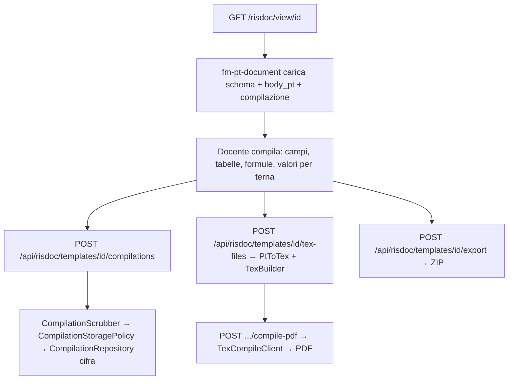

---
tags:
  - documentazione/architettura
  - dominio/risdoc
date: 2026-09-23
tipo: architettura
status: finale
aliases: ["risdoc", "risorse docente"]
cssclasses: []
---

# Dominio: risdoc

> [!abstract] Scopo
> Modelli documentali del docente (piano annuale, relazioni, programmi svolti, schede di recupero, …): schema JSON, editor PT nel browser, compilazioni cifrate, override per docente e per istituto, valori per terna, formule, export TeX/PDF. Dal 2026-09-04 i modelli non incorporano dati di alcun istituto: intestazione e logo vengono dal profilo del docente e dall'istanza.

## Confini del dominio

- **In**: docente autenticato, schema JSON, `body_pt` (Portable Text), file `.tex` di modello
- **Out**: form nel browser, TeX multi-file, PDF via microservizio, pacchetto ZIP

## Moduli interni

| Modulo | File | Responsabilità |
|--------|------|----------------|
| TemplateController | `app/Controllers/Risdoc/TemplateController.php` | lista, dettaglio, file, schema, TeX, override (docente e istituzionale), istanze multiple, `body_pt` seed, drift, sorgenti opzioni, asset condivisi, catch-all legacy; 1.012 righe, 23 metodi pubblici |
| TemplateViewController, TemplateEditorController | `app/Controllers/Risdoc/` | `/risdoc/view/{id}` (reso da `<fm-pt-document>`; `?admin_edit=1` per la struttura), `/risdoc/edit/{id}` |
| CompilationController | `app/Controllers/Risdoc/CompilationController.php` | compilazioni: `index`, `show`, `save`, `delete` |
| TexFilesController, ExportController, TeacherTexCommonController | `app/Controllers/Risdoc/` | file TeX multi-file e compile via microservizio; export ZIP (`buildFiles()`: `PtToTex` dal `body_pt`, altrimenti `TexBuilder` dallo schema); i tre file `texCommon` condivisi |
| CurriculumOptionsController | `app/Controllers/Risdoc/CurriculumOptionsController.php` | opzioni curricolari (obiettivi, competenze, …) con override istituto → globale → file (ADR-025) |
| RisdocAdminController | `app/Controllers/Admin/RisdocAdminController.php` | pannello admin: visibilità, collaboratori, review dei pending, meta, gruppi, creazione, sorgenti JSON |
| TemplateResolver | `app/Services/Risdoc/TemplateResolver.php` | risoluzione a tre livelli: override docente (per istanza) → override istituzionale → file; `institutionalTemplatesEnabled()` |
| CompilationScrubber, CompilationStoragePolicy | `app/Services/Risdoc/` | campi riferiti a studenti svuotati quando non esistono account; scelta per istituto fra server e solo browser (migration 103) |
| CompilationRepository, OverrideRepository, InstitutionalOverrideRepository, CurriculumDataRepository | `app/Repositories/Risdoc/` (non più sotto `app/Services/`, dal 2026-09-04) | compilazioni cifrate con la KEK del docente (migration 101); `risdoc_teacher_overrides`, `risdoc_institutional_overrides`, `risdoc_curriculum_data` |
| Permission, ReviewFlow, TemplateDefaults, InstituteAssets | `app/Services/Risdoc/` | permessi (deny by default), flusso di approvazione (`risdoc_template_pending_changes`), default per tipo, logo e intestazione dell'istanza. `FormRenderer` (render SSR) è stato tolto il 2026-09-23: nessun file lo istanziava |
| TexBuilder (risdoc) | `app/Services/Risdoc/TexBuilder.php` | TeX schema-driven da schema + compilazione |
| Pt/* | `app/Services/Risdoc/Pt/{PtToTex,PtToHtml,FormulaEngine,TernaBinding,TexBlockExtractor,TexSourceAutoDetector,SchemaSeeder,PtValidator,TexEscape}.php` | Portable Text → TeX (1.467 righe) e HTML, formule (specchio PHP del motore JS), binding per terna, estrazione blocchi dai `.tex`, validazione |
| Schemi | `schemas/risdoc/*.json` (16) + `template.schema.json` | struttura dei modelli |
| Template TeX | `storage/templates/risdoc/texCommon/{main.tex,risdoc.sty,intestaLAteX_IIS.tex}`, dataset curricolari per indirizzo/materia | wrapper LaTeX e sorgenti opzioni |
| Web Component | `js/components/pt-document/fm-pt-document.js`, `js/components/risdoc/*` | vedi [[domains/frontend/frontend-overview]] |
| JS | `js/modules/risdoc/pt/*`, `js/modules/features/risdoc-sidepage.js`, `risdoc-editor.js`, `admin-risdoc.js` | schema PM, conversioni, formule, terna, sidepage, admin |

## Flusso compilazione ed export

Dettaglio in [[domains/risdoc/tex-pipeline]].

## API pubblica verso altri domini

- `GET /api/risdoc/templates[/{id}[/schema|file|tex|overrides|instances|json-files|drift|compilations]]`
- `POST /api/risdoc/templates/{id}/{override|institutional-override|body-pt|instances|compilations|tex-files|tex-files/save|compile-pdf|export}`
- `GET /api/risdoc/curriculum-options`, `POST /api/risdoc/curriculum-options[/delete]`
- `GET /api/risdoc/teacher/instances`, `GET /api/risdoc/options-sources`, `GET /api/risdoc/shared/{file}`
- `/api/admin/risdoc/*` (super-admin)

## Tabelle

| Tabella | Scopo |
|---------|-------|
| `risdoc_templates` | catalogo; `visibility_scope`, `body_pt`, `schema_path`; `owner_id` droppata |
| `risdoc_template_collaborators`, `risdoc_template_visibility` | collaboratori e visibilità per docente |
| `risdoc_teacher_overrides` | override per docente e istanza (`instance_key`), kind `html|tex|css|json|image|texCommon` |
| `risdoc_institutional_overrides` | baseline istituzionale editabile (`schema` compreso) |
| `risdoc_template_pending_changes` | modifiche in attesa di approvazione (review flow) |
| `risdoc_compilations` (vista su `_data`) | compilazioni cifrate; il Modulo di autorizzazione e le sue compilazioni sono stati rimossi (migration 102) |
| `risdoc_curriculum_data` | opzioni curricolari dinamiche (ADR-025) |
| `institutes.compilation_storage` | server o solo browser, per istituto (migration 103) |

## Configurazione

`RISDOC_INSTITUTIONAL_TEMPLATES=false` nasconde i modelli istituzionali a
tutti gli account dell'istanza (ToS §2.5).

## Test

`tests/Unit/Risdoc/**` (i nove casi `TEST_ROT` della pipeline PT → TeX sono
stati decisi il 2026-09-04, [[testing]]), `RisdocResolverTest.php` (richiede
MariaDB; si crea il suo modello e il suo docente), `CompilationScrubberTest.php`, `CompilationStoragePolicyTest.php`,
`ReviewFlowGuardsTest.php`, `PendingStatusTest.php`; E2E `risdoc_*` e
`pt_document_*` (ferme a maggio, utente E2E fermo al gate ToS).

## Link correlati

[[domains/risdoc/tex-pipeline]] · [[decisions/ADR-002-lit3-web-components]] · [[decisions/ADR-005-schema-driven-risdoc]] · [[decisions/ADR-025-risdoc-curriculum-data-dynamic]] · [[decisions/ADR-026-models-as-custom-unification]] · [[decisions/ADR-030-document-terna-scoped-values]] · [[decisions/ADR-031-table-formulas]] · [[architecture]] · [[technical-debt]]
