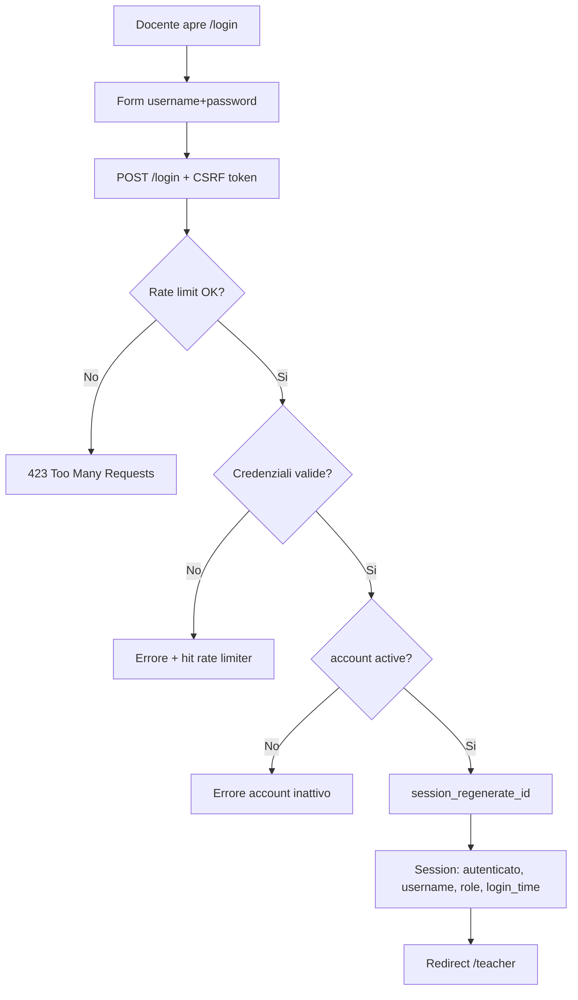
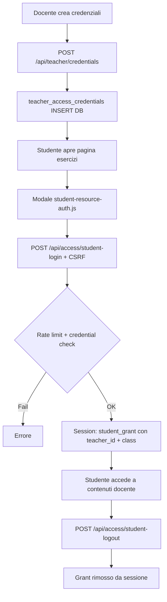

---
tags:
  - documentazione/user-flow
date: 2026-04-23
tipo: user-flow
status: finale
aliases: ["user-flows", "flussi"]
cssclasses: []
---

# User Flows

## Flusso 1 — Login docente



## Flusso 2 — Registrazione self-service

```mermaid
flowchart TD
    A[Utente /register] --> B[Form: username, email, nome, istituto, ruolo richiesto]
    B --> C[POST /register + CSRF]
    C --> D[RegistrationService::submit]
    D --> E[Validazione + hash password]
    E --> F[users INSERT status=pending, active=0]
    F --> G[Email notifica admin - RegistrationMailer]
    G --> H[Admin vede pending in /admin/registrations]
    H --> I{Admin approva?}
    I -- Si --> J[POST /admin/registrations/{id}/approve]
    J --> K[users UPDATE active=1, approved_by, approved_at]
    K --> L[Email conferma a utente]
    I -- No --> M[POST /admin/registrations/{id}/reject]
    M --> N[users UPDATE status=rejected]
```

## Flusso 3 — Export TeX/PDF risdoc (Plan B)

```mermaid
flowchart TD
    A[Docente su /risdoc/edit/{id}] --> B[Lit 3 WC carica schema JSON]
    B --> C[Docente compila form WC]
    C --> D[Click Salva compilazione]
    D --> E[POST /api/risdoc/templates/{id}/compilations]
    E --> F[CompilationRepository::save upsert DB]
    F --> G[Click Esporta ZIP / Overleaf]
    G --> H[POST /api/risdoc/templates/{id}/export]
    H --> I{.tex legacy disponibile?}
    I -- Si --> J[ExportController::processLegacyTex]
    J --> K[Sostituisce marker field-*, BeginList-*, ecc.]
    I -- No --> L[TexBuilder::build schema-driven fallback]
    K --> M[applyTextOverrides OverrideRepository]
    L --> M
    M --> N[Assembla ZIP: main.tex + doc.tex + risdoc.sty + images]
    N --> O[storage/risdoc-tmp/doc-{hex}.zip]
    O --> P{mode?}
    P -- zip --> Q[Response URL download]
    P -- overleaf --> R[Response overleaf_url con snip_uri]
    Q --> S[Browser download ZIP]
    R --> T[Browser redirect Overleaf import]
    T --> U[pdflatex su Overleaf → PDF]
```

## Flusso 4 — Gestione esercizi (editor inline)

```mermaid
flowchart TD
    A[Docente /teacher/templates] --> B[Lista collex-item caricata da DB]
    B --> C[Seleziona esercizi checkbox]
    C --> D[Click modificaBtn su item]
    D --> E[Editor inline aperto]
    E --> F[Modifica testo + CTRL+S o click saveBtn]
    F --> G[POST /api/teacher/content/{id}/quesito/{ref}/patch]
    G --> H{If-Match version OK?}
    H -- No --> I[409 Conflict - reload]
    H -- Si --> J[ContractAggregate::patchItem]
    J --> K[ContractRepository save + dual-write JSON]
    K --> L[Response ok:true, version:N]
    L --> M[UI aggiorna versione locale]
    M --> N[Click btnCopyver → genera LaTeX verifica]
    N --> O[print-export.js assembla TeX]
    O --> P[POST /verifiche/print-info save PrintInfo]
    P --> Q[Download/copia LaTeX]
```

## Flusso 5 — Accesso studente a contenuti docente



## Flusso 6 — Admin gestione utenti

```mermaid
flowchart TD
    A[Admin /admin] --> B[Dashboard: stats, pending registrations]
    B --> C{Pending registrations?}
    C -- Si --> D[/admin/registrations lista]
    D --> E[POST /admin/registrations/{id}/approve]
    E --> F[Utente attivato + email]
    B --> G[/api/admin/users lista completa]
    G --> H[POST /api/admin/users/{id}/role]
    H --> I[role aggiornato + Auth::refreshCurrentUserClaims]
    B --> J[/api/admin/security/anomalies]
    J --> K[AnomalyDetectionService analisi log]
    K --> L[POST /api/admin/security/credentials/block]
```
