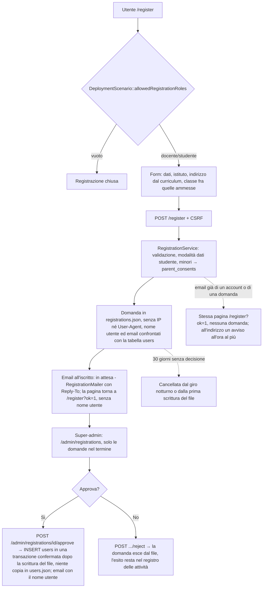
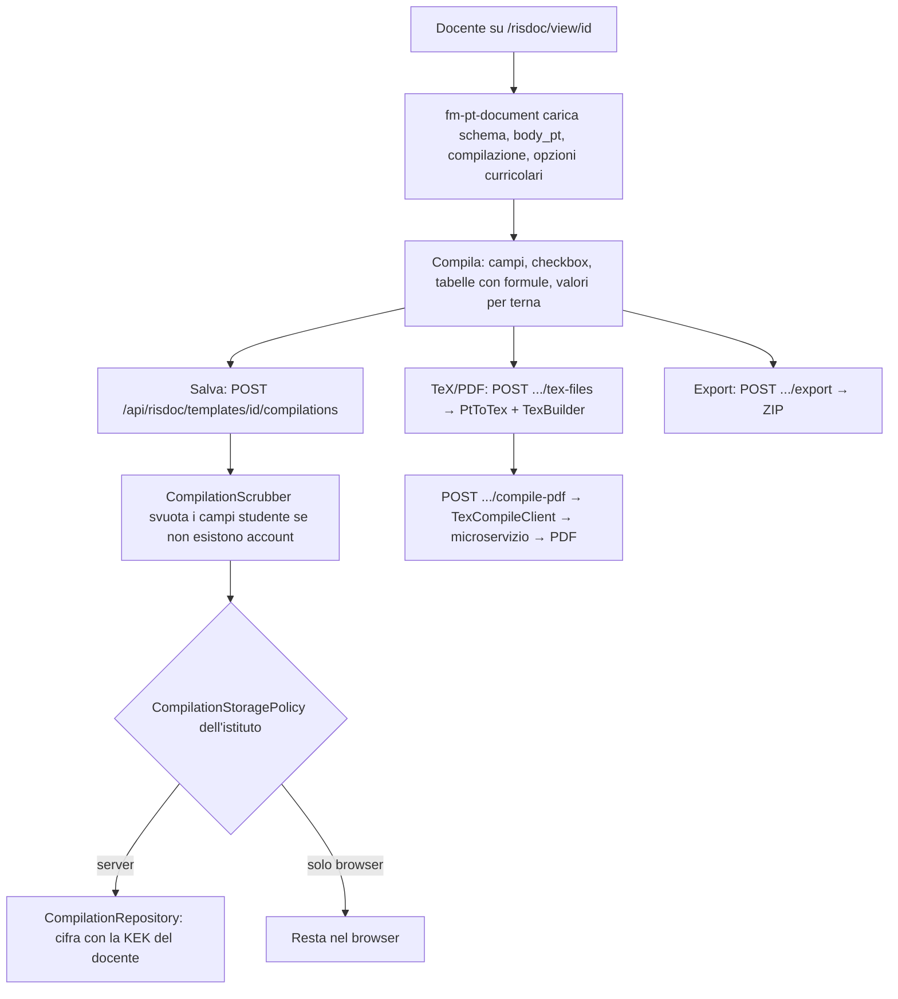

---
tags:
  - documentazione/user-flow
date: 2026-09-04
tipo: user-flow
status: finale
aliases: ["user-flows", "flussi"]
cssclasses: []
---

# User Flows

## Flusso 1 — Login docente con secondo fattore

```mermaid
flowchart TD
    A[Docente apre /login] --> B[Form username+password]
    B --> C[POST /login + CSRF + rate:login,10]
    C --> D{Rate limit, blocchi, password}
    D -- No --> E[/login?error=… + hit rate limiter]
    D -- Si --> F{2FA richiesta o attivata?}
    F -- Si --> G[Session pending_2fa → /login/2fa]
    G --> H[POST /login/2fa: codice app o email]
    H -- errato --> G
    H -- ok --> I[Auth::establishSession: regenerate id + claim]
    F -- No --> I
    I --> J{must_change_password / must_enrol_2fa?}
    J -- Si --> K[/me/change-password?force=1 o /me/2fa?force=1]
    J -- No --> L[Redirect /area-docente/dashboard]
```

## Flusso 2 — Registrazione secondo lo scenario

```mermaid
flowchart TD
    A[Utente /register] --> B{DeploymentScenario::allowedRegistrationRoles}
    B -- vuoto --> C[Registrazione chiusa]
    B -- docente/studente --> D[Form: dati, istituto, indirizzo dal curriculum, classe fra quelle ammesse]
    D --> E[POST /register + CSRF]
    E --> F[RegistrationService: validazione, modalità dati studente, minori → parent_consents]
    F --> G[Domanda in registrations.json, senza IP né User-Agent, nome utente ed email confrontati con la tabella users]
    G --> H[Email all'iscritto: in attesa - RegistrationMailer con Reply-To; la pagina torna a /register?ok=1, senza nome utente]
    F -. email già di un account o di una domanda .-> N[Stessa pagina /register?ok=1, nessuna domanda; all'indirizzo un avviso all'ora al più]
    H --> I[Super-admin: /admin/registrations, solo le domande nel termine]
    I --> J{Approva?}
    J -- Si --> K[POST /admin/registrations/id/approve → INSERT users in una transazione confermata dopo la scrittura del file, niente copia in users.json; email con il nome utente]
    J -- No --> L[POST .../reject → la domanda esce dal file, l'esito resta nel registro delle attività]
    G -. 30 giorni senza decisione .-> M[Cancellata dal giro notturno o dalla prima scrittura del file]
```

## Flusso 3 — Accesso di classe senza account (scenari 1 e 2)

```mermaid
flowchart TD
    A[Docente crea credenziale per classe: POST /api/teacher/credentials] --> B[teacher_access_credentials]
    B --> C[Studente apre /accesso-classe]
    C --> D[POST /api/access/student-login + CSRF + rate]
    D --> E{Credenziale valida e attiva?}
    E -- No --> F[Errore]
    E -- Si --> G[ClassAccessGrant in sessione: teacher_id, classe, istituto]
    G --> H[/studio/... e mappe mostrano solo il pubblicato del docente per la classe]
    H --> I[POST /accesso-classe/esci → grant rimosso]
```

## Flusso 4 — Documento risdoc: compilazione, salvataggio, PDF

```mermaid
flowchart TD
    A[Docente su /risdoc/view/id] --> B[fm-pt-document carica schema, body_pt, compilazione, opzioni curricolari]
    B --> C[Compila: campi, checkbox, tabelle con formule, valori per terna]
    C --> D[Salva: POST /api/risdoc/templates/id/compilations]
    D --> E[CompilationScrubber svuota i campi studente se non esistono account]
    E --> F{CompilationStoragePolicy dell'istituto}
    F -- server --> G[CompilationRepository: cifra con la KEK del docente]
    F -- solo browser --> H[Resta nel browser]
    C --> I[TeX/PDF: POST .../tex-files → PtToTex + TexBuilder]
    I --> J[POST .../compile-pdf → TexCompileClient → microservizio → PDF]
    C --> K[Export: POST .../export → ZIP]
```

## Flusso 5 — Editor esercizi e verifica

```mermaid
flowchart TD
    A[Docente /studio/esercizio/ind/cls/mat/topic] --> B[Contract reso da ContractRenderer]
    B --> C[Editor inline su un collex-item]
    C --> D[Salva: POST /api/teacher/content/id/quesito/ref/patch con If-Match]
    D --> E{Versione coincide?}
    E -- No --> F[409 → conflict-resolver]
    E -- Si --> G[ContractAggregate::patchItem → ContractRepository (cifrato)]
    G --> H[Seleziona esercizi → SalvaTEX]
    H --> I[buildSelectionFromDOM → POST /api/verifica/save-tex-batch]
    I --> J[TexBuilder per variante → VerificaDocumentService: 8 righe + blob cifrati]
    J --> K[POST /api/verifica/id/compile → PDF; zip; sync Drive/locale]
```

## Flusso 6 — Amministrazione

```mermaid
flowchart TD
    A[Admin /admin: strumenti] --> B[Utenti, registrazioni, log, notifiche]
    A --> C[/admin/dashboard: riquadri]
    B --> D[POST /api/admin/users/id/role + X-Audit-Reason]
    D --> E[Auth::refreshCurrentUserClaims + privileged_access_log]
    C --> F[/admin/sections: incarichi docenti, classe studenti]
    C --> G[/admin/system/deployment: scenario, 2FA, ToS, classi ammesse]
    G --> H[storage/config/*.json + privileged_access_log con motivazione]
    C --> I[/admin/waf, /admin/gdpr, /admin/crypto-status, /admin/backup, /admin/logs]
```

## Flusso 7 — Registro delle operazioni

Ogni scrittura HTTP e ogni tentativo negato (anche di studente o ospite)
passa da `Kernel::logActivity` → `ActivityLogger` → `audit_activity_log`
(IP e User-Agent come hash). Le letture del super-admin su dati altrui
passano da `sadmin_audit` → `privileged_access_log`. Ogni notte
`export_audit_chain.php` calcola l'impronta concatenata e la esporta con
il backup.
